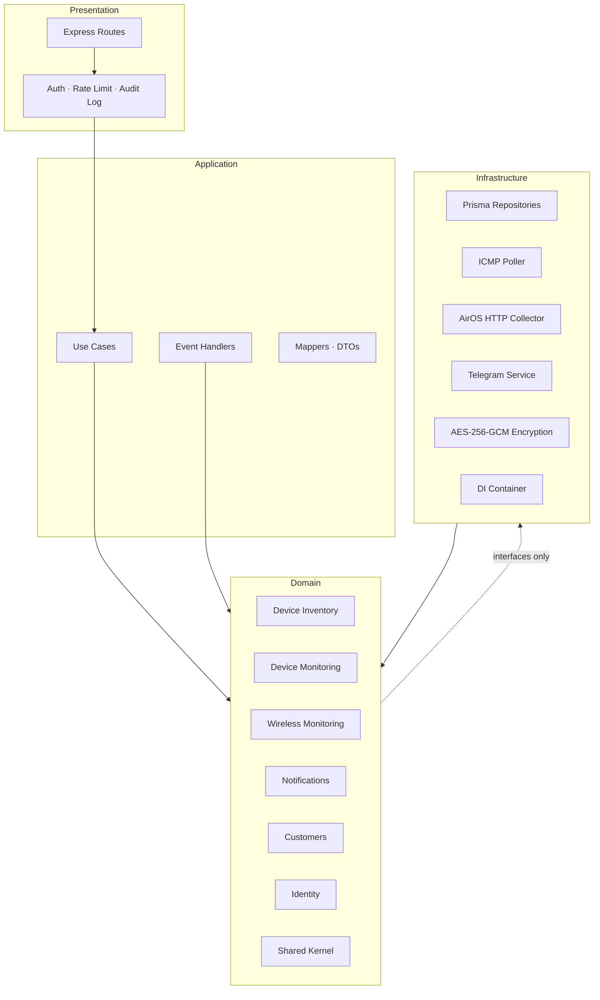
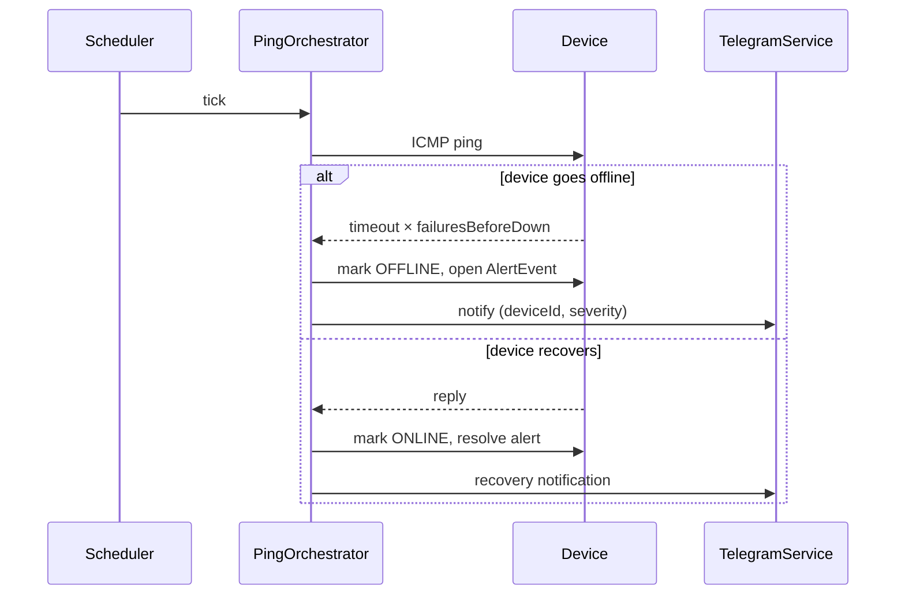

# Network Management System — Backend

Production-grade monitoring and management backend for a live ISP network (150+ clients, Ubiquiti AirOS infrastructure).

---

## The Problem

Managing a small ISP with dozens of wireless links, CPEs, and routers across multiple towers means your failure detection is usually a phone call from an angry customer. This system replaces that with real-time ICMP polling, Ubiquiti AirOS metric collection over their HTTP API, Telegram alerting, and a full inventory of every device, vendor, and customer service contract — all built to survive the chaos of a real network.

---

## Live API Sample

```bash
# Trigger a manual poll on a device
curl -s -X POST http://localhost:3000/api/devices/abc-123/poll \
  -H "Authorization: Bearer $TOKEN" | jq .

{
  "deviceId": "abc-123",
  "status": "SUCCESS",
  "message": "Device responded in 4ms",
  "timestamp": "2026-06-30T22:14:03.512Z",
  "metrics": { "latencyMs": 4 },
  "deviceStatus": "ONLINE"
}
```

```bash
# Get wireless status for a Ubiquiti antenna
curl -s http://localhost:3000/api/devices/def-456/wireless/status \
  -H "Authorization: Bearer $TOKEN" | jq '.metrics | {signalRxDbm, ccqPercent, throughputTxBps}'

{
  "signalRxDbm": -64,
  "ccqPercent": 94,
  "throughputTxBps": 8241920
}
```

---

## Architecture



**Dependency rule:** inner layers never import from outer ones. Domain has zero framework dependencies.



---

## Bounded Contexts

| Context                 | Responsibility                                                       |
| ----------------------- | -------------------------------------------------------------------- |
| **Device Inventory**    | Devices, models, vendors, locations, credentials, network scan       |
| **Device Monitoring**   | ICMP polling, online/offline state, polling config, ping history     |
| **Wireless Monitoring** | AirOS HTTP polling, signal/CCQ/throughput snapshots, wireless alerts |
| **Notifications**       | Telegram dispatch, delivery tracking, alert lifecycle                |
| **Customers**           | Customer records, service plans, contracted services                 |
| **Identity**            | JWT auth, RBAC (Admin / Operator / Viewer), audit log                |

Shared kernel (`domain/shared/`): `AggregateRoot`, `Entity`, `ValueObject`, `Result`, `Guard`, `DomainEvent`, `IPAddress`.

---

## Tech Stack

| Layer         | Technology                                    |
| ------------- | --------------------------------------------- |
| Runtime       | Node.js 24, TypeScript                        |
| Framework     | Express 5                                     |
| ORM / DB      | Prisma 7 + PostgreSQL (`pg` adapter)          |
| Architecture  | Clean Architecture + DDD                      |
| Auth          | JWT (HS256, 24 h), bcrypt (cost 10)           |
| Encryption    | AES-256-GCM (device credentials at rest)      |
| Logging       | Winston (structured JSON in production)       |
| Notifications | Telegram Bot API                              |
| Testing       | Jest (unit), Supertest (integration, real DB) |

---

## Engineering Notes

### Why HTTP API instead of SNMP for Ubiquiti devices

The initial plan was standard SNMPv2 polls against Ubiquiti's MIBs. Field testing showed the problem: AirOS exposes very little through the standard MIB tree. Signal strength, CCQ, airMAX capacity scores, connected client details, and remote CPE diagnostics are only available through the proprietary `/status.cgi` and `/sta.cgi` HTTP endpoints.

The HTTP API returns a single JSON blob with 50+ fields per device per request — one round-trip beats five SNMP walks. It also gives you the full client list on access points (MAC, signal, throughput, uptime, CPE firmware) which SNMP does not expose at all. The tradeoff is vendor lock-in to AirOS; multi-vendor polling (Mikrotik RouterOS API, generic SNMP) is planned behind an `IVendorPoller` abstraction.

### Topology-aware alert suppression (in design)

When an AP goes offline, every CPE under it appears offline too — a 20-device AP can generate 21 simultaneous Telegram messages. The planned suppression model: the `NetworkTopology` aggregate stores a child→parent edge map. On each offline event, `TopologyRootCauseService` walks the chain (CPE → AP → PoE switch → backhaul → provider link) and only notifies if no ancestor is already down. One message for the root cause; descendants are suppressed. See `docs/TODOS.md` for the full design.

### Result + Guard pattern throughout the domain

No `try/catch` for business rule violations. Every use case and aggregate method returns `Result<T, string>` — success or a named failure. `Guard.againstNullOrUndefined` handles null checks at aggregate boundaries. This keeps the domain free of framework error classes and makes failure paths explicit in the type system.

### Device status lifecycle enforced at domain layer

Status transitions (`INVENTORY → COMMISSIONING → ACTIVE → DAMAGED`) carry hard invariants enforced inside the `Device` aggregate, not in controllers:

- `COMMISSIONING` requires an IP address and auto-enables monitoring
- `ACTIVE` requires both IP and location
- Transitioning to `DAMAGED` or `INVENTORY` automatically disables polling

---

## Getting Started

### Prerequisites

- Node.js 24+
- PostgreSQL 15+

### Install

```sh
npm install
```

### Environment

Copy `.env.example` and fill in the values:

```sh
cp .env.example .env
```

Key variables:

| Variable                 | Description                                                                                                        |
| ------------------------ | ------------------------------------------------------------------------------------------------------------------ |
| `DATABASE_URL`           | PostgreSQL connection string                                                                                       |
| `JWT_SECRET`             | HS256 signing secret (≥ 32 random bytes)                                                                           |
| `DEVICE_CREDENTIALS_KEY` | AES-256-GCM key as hex — generate with: `node -e "console.log(require('crypto').randomBytes(32).toString('hex'))"` |
| `TELEGRAM_BOT_TOKEN`     | Bot token from @BotFather                                                                                          |
| `TELEGRAM_CHAT_ID`       | Target chat or group ID                                                                                            |

### Database

```sh
npm run db:migrate:dev   # run migrations
npm run db:seed          # create admin user (SEED_ADMIN_EMAIL / SEED_ADMIN_PASSWORD)
```

### Run

```sh
npm run dev     # watch mode
npm run build && npm start   # production
```

### Test

```sh
npm test                  # unit tests
npm run test:integration  # requires a running PostgreSQL instance
```

---

## API Overview

All endpoints require `Authorization: Bearer <token>` except `POST /api/auth/login`.

| Group               | Base path                                             |
| ------------------- | ----------------------------------------------------- |
| Auth                | `POST /api/auth/login`                                |
| Devices             | `/api/devices`                                        |
| Credentials         | `/api/devices/:id/credentials`                        |
| Polling             | `/api/devices/:id/poll`, `/api/devices/:id/polling/*` |
| Wireless            | `/api/devices/:id/wireless/*`                         |
| Locations           | `/api/locations`                                      |
| Vendors             | `/api/vendors`                                        |
| Device Models       | `/api/device-models`                                  |
| Alerts              | `/api/alerts`                                         |
| Customers           | `/api/customers`                                      |
| Service Plans       | `/api/service-plans`                                  |
| Contracted Services | `/api/contracted-services`                            |
| Network Scan        | `POST /api/network/scan`                              |

Full spec: [`docs/BACKEND_API.md`](docs/BACKEND_API.md)

---

## Project Structure

```
src/
├── domain/                     # Pure business logic — no framework dependencies
│   ├── shared/                 # Kernel: AggregateRoot, Result, Guard, IPAddress, IDs
│   ├── device-inventory/       # Device, DeviceModel, Vendor, Location aggregates
│   ├── device-monitoring/      # PollingConfiguration, ping state machine
│   ├── wireless-monitoring/    # WirelessSnapshot, WirelessAlertRecord
│   ├── notifications/          # Alert lifecycle, Telegram dispatch
│   ├── customers/              # Customer, ServicePlan, ContractedService
│   └── identity/               # User, Role
│
├── application/                # Orchestration — use cases, DTOs, mappers, event handlers
│   ├── device-inventory/
│   ├── device-monitoring/
│   ├── wireless-monitoring/
│   ├── notifications/
│   ├── customers/
│   └── identity/
│
├── infrastructure/             # Adapters — DB, HTTP clients, encryption, DI
│   ├── persistence/            # Prisma repositories
│   ├── wireless-monitoring/    # AirOS HTTP collector, SNMP adapter
│   ├── monitoring/             # ICMP ping orchestrator, network scanner
│   ├── notifications/          # Telegram service
│   ├── crypto/                 # AES-256-GCM credentials encryption
│   ├── identity/               # JWT service, bcrypt
│   ├── logging/                # Winston logger
│   └── di/                     # Dependency injection container
│
└── presentation/
    ├── http/                   # Express routes, controllers, middleware, validation
    └── websocket/              # WebSocket gateway
```

---

## Frontend

The frontend repo lives at [papitapapita/network-monitor-frontend](https://github.com/papitapapita/network-monitor-frontend) _(link placeholder — update when public)_.

---

## License

MIT — see [LICENSE](LICENSE).
