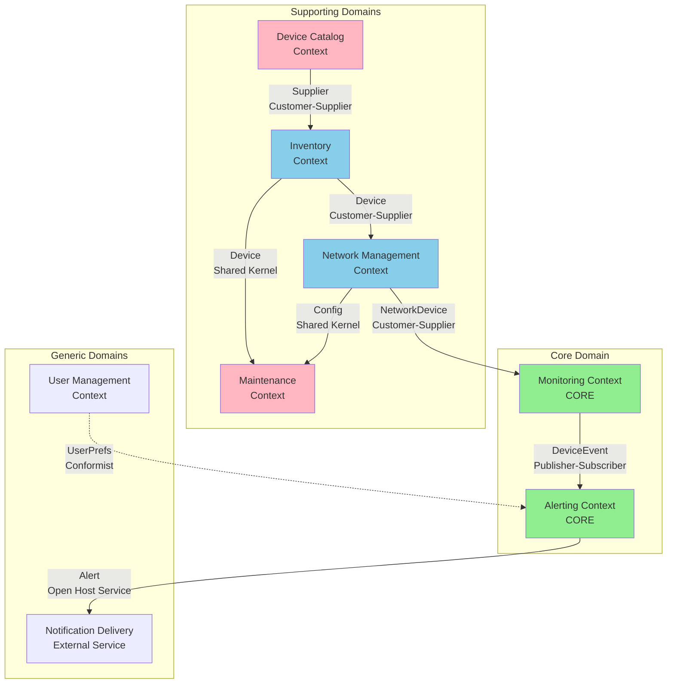
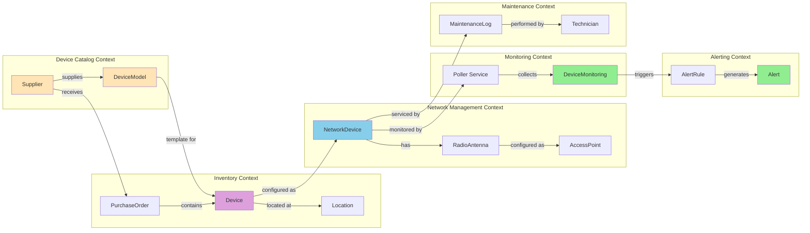

# Context Map - Bounded Context Relationships

## Overview

This document describes the **Context Map** for the Network Monitoring Platform—how bounded contexts relate to and integrate with each other. It defines the nature of relationships, data flow patterns, and integration patterns between contexts.

---

## Table of Contents

1. [Context Map Diagram](#context-map-diagram)
2. [Context Relationship Patterns](#context-relationship-patterns)
3. [Context Integration Catalog](#context-integration-catalog)
4. [Shared Kernel](#shared-kernel)
5. [Published Language](#published-language)
6. [Anti-Corruption Layers](#anti-corruption-layers)
7. [Evolution Strategy](#evolution-strategy)

---

## Context Map Diagram

### High-Level Context Map



### Detailed Relationship Map



---

## Context Relationship Patterns

### Pattern Definitions

| Pattern                         | Definition                                                                      | When to Use                                                 |
| ------------------------------- | ------------------------------------------------------------------------------- | ----------------------------------------------------------- |
| **Customer-Supplier**           | Downstream context depends on upstream. Upstream has obligations to downstream. | When one context provides data/services another needs       |
| **Conformist**                  | Downstream conforms to upstream model without negotiation.                      | When downstream has no influence over upstream              |
| **Shared Kernel**               | Two contexts share a subset of the domain model.                                | When contexts are tightly related and share common concepts |
| **Partnership**                 | Two contexts have mutual dependency and evolve together.                        | When teams must coordinate changes                          |
| **Published Language**          | Upstream publishes a well-documented, stable API.                               | When many consumers need integration                        |
| **Open Host Service**           | Upstream provides a service accessible to many consumers.                       | When service has multiple clients                           |
| **Anti-Corruption Layer (ACL)** | Downstream protects itself from upstream changes via translation layer.         | When upstream model is poor or unstable                     |
| **Separate Ways**               | Contexts have no integration—completely independent.                            | When integration cost exceeds benefit                       |

---

## Context Integration Catalog

### 1. Device Catalog → Inventory (Customer-Supplier)

**Relationship Type**: Customer-Supplier

**Direction**: Device Catalog (Upstream) → Inventory (Downstream)

**Integration Pattern**: Reference by ID

**Data Flow**:

```
Device Catalog              Inventory
┌──────────────┐           ┌──────────────┐
│ DeviceModel  │           │   Device     │
│  - id        │◄──────────│  - modelId   │
│  - name      │           │  - serial    │
└──────────────┘           └──────────────┘
```

**Shared Concepts**:

- `DeviceModelId` - Foreign key reference
- `Vendor` enum
- `DeviceType` enum

**Integration Points**:

```typescript
// Inventory Context (Downstream)
class Device {
  private deviceModelId: string; // Reference to Device Catalog

  async getModel(): Promise<DeviceModel> {
    return deviceCatalogService.getModel(this.deviceModelId);
  }
}
```

**Responsibilities**:

- **Upstream (Device Catalog)**: Maintain stable DeviceModel IDs, notify downstream of discontinued models
- **Downstream (Inventory)**: Handle missing models gracefully, cache model data

**Evolution Agreement**:

- Device Catalog must not delete models that have associated devices
- New model attributes are additive only (no breaking changes)

---

### 2. Inventory → Network Management (Customer-Supplier)

**Relationship Type**: Customer-Supplier

**Direction**: Inventory (Upstream) → Network Management (Downstream)

**Integration Pattern**: Reference by ID + Shared Events

**Data Flow**:

```
Inventory                    Network Management
┌──────────────┐            ┌──────────────────┐
│   Device     │            │  NetworkDevice   │
│  - id        │◄───────────│  - deviceId      │
│  - location  │            │  - ipAddress     │
│  - status    │            │  - config        │
└──────────────┘            └──────────────────┘
     │
     │ Event: DeviceActivated
     ▼
┌──────────────────┐
│ Network Mgmt     │
│ Listens & Creates│
└──────────────────┘
```

**Shared Concepts**:

- `DeviceId` - Foreign key reference
- `DeviceStatus` - Shared enum (but different meaning in each context)
- `Location` - Physical vs logical location

**Integration Points**:

```typescript
// Network Management Context (Downstream)
class NetworkDevice {
  private deviceId: string; // Reference to physical device

  async getPhysicalDevice(): Promise<Device> {
    return inventoryService.getDevice(this.deviceId);
  }
}

// Event Handler
class DeviceActivatedHandler implements DomainEventHandler {
  handle(event: DeviceActivatedEvent): void {
    // Create corresponding NetworkDevice when physical device activated
    const networkDevice = NetworkDevice.create({
      deviceId: event.deviceId
      // ...
    });
  }
}
```

**Responsibilities**:

- **Upstream (Inventory)**: Emit events when device status changes, maintain device-location association
- **Downstream (Network Management)**: React to device lifecycle events, maintain referential integrity

**Conflict Resolution**:

- If physical device is deactivated in Inventory, Network Management marks NetworkDevice as OFFLINE
- Physical location (Inventory) is source of truth; Network Management may cache it

---

### 3. Network Management → Monitoring (Customer-Supplier)

**Relationship Type**: Customer-Supplier

**Direction**: Network Management (Upstream) → Monitoring (Downstream)

**Integration Pattern**: Reference by ID + Polling Configuration

**Data Flow**:

```
Network Management          Monitoring
┌──────────────────┐       ┌──────────────────┐
│  NetworkDevice   │       │ PollerService    │
│  - id            │──────►│ - devices[]      │
│  - ipAddress     │       │ - pollingConfig  │
│  - protocol      │       └──────────────────┘
│  - credentials   │                │
└──────────────────┘                │
                                    ▼
                           ┌──────────────────┐
                           │ DeviceMonitoring │
                           │ - networkDeviceId│
                           │ - metrics        │
                           └──────────────────┘
```

**Shared Concepts**:

- `NetworkDeviceId` - Primary identifier
- `ManagementProtocol` - SNMP, SSH, HTTP, etc.
- `NetworkDeviceStatus` - ONLINE, OFFLINE, MAINTENANCE

**Integration Points**:

```typescript
// Monitoring Context (Downstream)
class PollerService {
  async addDevice(deviceId: string): Promise<void> {
    // Fetch device config from Network Management
    const device = await networkManagementService.getDevice(deviceId);

    // Configure poller based on device protocol
    this.configurePoller(device);
  }
}

// Monitoring emits events back to Network Management
class DeviceOfflineHandler implements DomainEventHandler {
  handle(event: DeviceOfflineEvent): void {
    // Update NetworkDevice status in Network Management context
    networkManagementService.updateDeviceStatus(
      event.networkDeviceId,
      NetworkDeviceStatus.OFFLINE
    );
  }
}
```

**Responsibilities**:

- **Upstream (Network Management)**: Provide device configuration, credentials, management protocol
- **Downstream (Monitoring)**: Poll devices, collect metrics, emit status events

**Data Synchronization**:

- Monitoring polls Network Management every 5 minutes for device list changes
- Network Management listens to Monitoring events to update device status

---

### 4. Monitoring → Alerting (Publisher-Subscriber)

**Relationship Type**: Publisher-Subscriber (Event-Driven)

**Direction**: Monitoring (Publisher) → Alerting (Subscriber)

**Integration Pattern**: Domain Events

**Data Flow**:

```
Monitoring                  Event Bus              Alerting
┌──────────────┐           ┌─────────┐           ┌──────────────┐
│ DeviceOffline│──────────►│ Event   │──────────►│ AlertRule    │
│ Event        │           │ Dispatcher│          │ Evaluation   │
└──────────────┘           └─────────┘           └──────────────┘
                                                         │
                                                         ▼
                                                  ┌──────────────┐
                                                  │ Alert        │
                                                  │ Created      │
                                                  └──────────────┘
```

**Published Events** (from Monitoring):

```typescript
interface DeviceOfflineEvent {
  networkDeviceId: string;
  timestamp: Date;
  consecutiveFailures: number;
}

interface HighLatencyDetectedEvent {
  networkDeviceId: string;
  latency: number;
  threshold: number;
}

interface HighPacketLossDetectedEvent {
  networkDeviceId: string;
  packetLoss: number;
  threshold: number;
}

interface DeviceMetricsCollectedEvent {
  networkDeviceId: string;
  metrics: DeviceMonitoringProps;
}
```

**Integration Points**:

```typescript
// Monitoring Context (Publisher)
class PollerService {
  private emitDeviceOffline(
    deviceId: string,
    failures: number
  ): void {
    const event = new DeviceOfflineEvent(
      deviceId,
      new Date(),
      failures
    );
    EventDispatcher.publish(event);
  }
}

// Alerting Context (Subscriber)
class DeviceOfflineEventHandler
  implements DomainEventHandler<DeviceOfflineEvent>
{
  handle(event: DeviceOfflineEvent): void {
    // Evaluate if alert should be created
    const alert = this.alertService.evaluateDeviceOffline(event);

    if (alert) {
      // Trigger notification
      this.notificationService.send(alert);
    }
  }
}
```

**Responsibilities**:

- **Upstream (Monitoring)**: Emit events when metrics collected or thresholds exceeded
- **Downstream (Alerting)**: Subscribe to relevant events, evaluate alert rules, trigger notifications

**Decoupling Benefits**:

- Monitoring doesn't know about Alerting
- New alert types can be added without changing Monitoring
- Events can be logged, replayed, or consumed by analytics

---

### 5. Alerting → Notification Delivery (Open Host Service)

**Relationship Type**: Open Host Service

**Direction**: Alerting (Host) → Notification Delivery (Client)

**Integration Pattern**: External API

**Data Flow**:

```
Alerting                    Notification Service
┌──────────────┐           ┌──────────────────┐
│ Alert        │           │ SMTP (Email)     │
│ - severity   │──────────►│ SendGrid         │
│ - message    │           ├──────────────────┤
│ - channels   │           │ SMS (Twilio)     │
└──────────────┘           ├──────────────────┤
                           │ Slack Webhook    │
                           ├──────────────────┤
                           │ Telegram Bot     │
                           └──────────────────┘
```

**Shared Concepts** (Published Language):

```typescript
interface NotificationRequest {
  recipient: string;
  subject: string;
  body: string;
  severity: 'info' | 'warning' | 'critical';
  channel: 'email' | 'sms' | 'slack' | 'telegram';
}

interface NotificationResponse {
  id: string;
  status: 'sent' | 'failed' | 'pending';
  timestamp: Date;
}
```

**Integration Points**:

```typescript
// Alerting Context
class NotificationService {
  async sendNotification(
    alert: Alert,
    channel: NotificationChannel
  ): Promise<void> {
    const request: NotificationRequest = {
      recipient: channel.recipient,
      subject: alert.title,
      body: alert.message,
      severity: alert.severity,
      channel: channel.type
    };

    // Call external service
    await this.externalNotificationService.send(request);
  }
}
```

**Responsibilities**:

- **Host (Alerting)**: Define notification API, format messages
- **Client (External Services)**: Deliver notifications via their respective channels

**Anti-Corruption Layer**:

- Alerting context wraps external services to prevent vendor lock-in
- Easy to swap email providers (Nodemailer → SendGrid → AWS SES)

---

### 6. Inventory ↔ Maintenance (Shared Kernel)

**Relationship Type**: Shared Kernel

**Direction**: Bidirectional

**Integration Pattern**: Shared Domain Model

**Shared Concepts**:

```
Shared Kernel
┌────────────────────────┐
│ Device                 │
│ Location               │
│ DeviceStatus enum      │
│ MaintenanceType enum   │
└────────────────────────┘
       ▲         ▲
       │         │
┌──────┴───┐ ┌──┴────────┐
│Inventory │ │Maintenance│
│ Context  │ │  Context  │
└──────────┘ └───────────┘
```

**Shared Domain Model**:

```typescript
// Shared between both contexts
enum DeviceStatus {
  ACTIVE,
  INACTIVE,
  DEGRADED,
  MAINTENANCE, // ← Shared understanding
  OUT_OF_SERVICE,
  DAMAGED
}

enum MaintenanceType {
  PREVENTIVE,
  CORRECTIVE,
  PREDICTIVE,
  EMERGENCY
}
```

**Integration Points**:

```typescript
// Both contexts use the same Device entity
class Device extends AggregateRoot<DeviceProps> {
  sendToMaintenance(): void {
    this.status = DeviceStatus.MAINTENANCE;
  }

  returnFromMaintenance(): void {
    this.status = DeviceStatus.ACTIVE;
  }
}

// Maintenance Context
class DeviceMaintenanceLog {
  async start(): Promise<void> {
    // Update shared Device status
    this.device.sendToMaintenance();
  }

  async complete(): Promise<void> {
    // Update shared Device status
    this.device.returnFromMaintenance();
  }
}
```

**Coordination Requirements**:

- Both teams must agree on changes to shared model
- Breaking changes require coordination
- Shared code lives in `/src/domain/shared/`

**Shared Kernel Risks**:

- High coupling between contexts
- Changes require coordination
- Should be limited to truly shared concepts

---

### 7. User Management → Alerting (Conformist)

**Relationship Type**: Conformist

**Direction**: User Management (Upstream) → Alerting (Downstream)

**Integration Pattern**: Read-Only Access

**Data Flow**:

```
User Management             Alerting
┌──────────────┐           ┌──────────────┐
│ User         │           │ Alert        │
│ - id         │◄──────────│ - userId     │
│ - email      │           │ - read alert │
│ - prefs      │           │   preferences│
└──────────────┘           └──────────────┘
```

**Integration Points**:

```typescript
// Alerting Context (Downstream - Conformist)
class NotificationService {
  async sendAlert(alert: Alert): Promise<void> {
    // Fetch user preferences from User Management
    const user = await userManagementService.getUser(alert.userId);

    // Conform to User Management's model
    const channels = user.notificationPreferences.channels;

    for (const channel of channels) {
      await this.send(alert, channel);
    }
  }
}
```

**Responsibilities**:

- **Upstream (User Management)**: Define user model, provide read-only access
- **Downstream (Alerting)**: Consume user data as-is, no negotiation

**Why Conformist**:

- Alerting has no influence over User Management model
- User Management is a generic subdomain (could be replaced with Auth0, Okta)
- Alerting just needs basic user data (email, preferences)

---

## Shared Kernel

### Domain Kernel

All contexts share the **DDD building blocks**:

**Location**: `/src/domain/shared/kernel/`

**Shared Components**:

```typescript
// Shared by all contexts
export abstract class Entity<T>
export abstract class ValueObject<T>
export abstract class AggregateRoot<T>
export class Result<T>
export class Guard
export class UniqueEntityID
export class EventDispatcher
```

**Why Shared**:

- These are foundational patterns, not business concepts
- All contexts use the same DDD tactical patterns
- Changes to kernel are rare and coordinated

---

### Value Objects

Some value objects are shared across contexts:

**Shared Value Objects**:

```typescript
// Shared across multiple contexts
export class Email extends ValueObject<EmailProps>
export class PhoneNumber extends ValueObject<PhoneNumberProps>
export class Address extends ValueObject<AddressProps>
```

**Context-Specific Value Objects**:

```typescript
// Monitoring Context only
export class PollingInterval extends ValueObject<PollingIntervalProps>

// Network Management Context only
export class IPAddress extends ValueObject<IPAddressProps>
```

---

## Published Language

### REST API (Published Language)

The **REST API** serves as a published language for external consumers:

**Location**: `/src/presentation/http/`

**API Contracts** (OpenAPI/Swagger):

```yaml
/api/network-devices:
  get:
    summary: List network devices
    parameters:
      - name: page
        schema: { type: integer }
      - name: status
        schema: { enum: [ONLINE, OFFLINE, MAINTENANCE] }
    responses:
      200:
        schema:
          type: object
          properties:
            data:
              {
                type: array,
                items: { $ref: '#/components/schemas/NetworkDevice' }
              }
            pagination: { $ref: '#/components/schemas/Pagination' }
```

**Why Published Language**:

- Multiple consumers (web dashboard, mobile app, integrations)
- Stable, versioned API (breaking changes require new version)
- Well-documented with OpenAPI specification
- Decouples external consumers from internal domain model

---

### Domain Events (Published Language)

**Event Schema** (JSON):

```json
{
  "eventType": "NetworkDeviceOfflineEvent",
  "eventVersion": "1.0",
  "aggregateId": "device-123",
  "timestamp": "2025-12-03T10:30:00Z",
  "payload": {
    "networkDeviceId": "device-123",
    "consecutiveFailures": 5
  }
}
```

**Why Published Language**:

- Events are contracts between contexts
- Versioned to support schema evolution
- Consumers can subscribe without knowing publisher internals

---

## Anti-Corruption Layers

### External Email Service ACL

**Purpose**: Protect Alerting context from changes to email provider.

**Implementation**:

```typescript
// Anti-Corruption Layer
interface IEmailService {
  send(notification: Notification): Promise<void>;
}

// Adapter for Nodemailer
class NodemailerAdapter implements IEmailService {
  async send(notification: Notification): Promise<void> {
    const transport = nodemailer.createTransport({...});
    await transport.sendMail({
      to: notification.recipient,
      subject: notification.subject,
      text: notification.body
    });
  }
}

// Adapter for SendGrid
class SendGridAdapter implements IEmailService {
  async send(notification: Notification): Promise<void> {
    const mail = {
      to: notification.recipient,
      subject: notification.subject,
      text: notification.body
    };
    await sgMail.send(mail);
  }
}

// Alerting Context uses interface, not implementation
class NotificationService {
  constructor(private emailService: IEmailService) {}

  async sendEmail(alert: Alert): Promise<void> {
    const notification = this.formatNotification(alert);
    await this.emailService.send(notification); // ← ACL
  }
}
```

**Benefits**:

- Easy to swap email providers
- Alerting context independent of email service API
- Can mock email service for testing

---

### Future: SNMP ACL

**Purpose**: Protect Monitoring context from SNMP library changes.

**Planned Implementation**:

```typescript
// Anti-Corruption Layer
interface ISNMPClient {
  get(oid: string): Promise<SNMPValue>;
  walk(oid: string): Promise<SNMPValue[]>;
}

// Adapter for net-snmp
class NetSNMPAdapter implements ISNMPClient {
  async get(oid: string): Promise<SNMPValue> {
    // Translate to net-snmp API
  }
}

// Monitoring Context
class SNMPPoller {
  constructor(private snmpClient: ISNMPClient) {}

  async poll(device: NetworkDevice): Promise<Metrics> {
    const value = await this.snmpClient.get('1.3.6.1.2.1.1.3.0');
    return this.parseMetrics(value);
  }
}
```

---

## Evolution Strategy

### Current State (Monolith)

All contexts currently live in a **single codebase** with **shared database**:

```
┌────────────────────────────────────┐
│      Monolithic Application        │
├────────────────────────────────────┤
│  Device Catalog Context            │
│  Inventory Context                 │
│  Network Management Context        │
│  Monitoring Context                │
│  Alerting Context                  │
│  Maintenance Context               │
│  User Management Context           │
├────────────────────────────────────┤
│      Shared PostgreSQL DB          │
└────────────────────────────────────┘
```

**Advantages**:

- Simple deployment
- Easy cross-context queries
- Single database transaction
- Lower operational complexity

**Disadvantages**:

- Tight coupling
- Hard to scale independently
- Single point of failure

---

### Phase 1: Modular Monolith (Current Goal)

**Organize code by bounded context** with clear module boundaries:

```
src/
├── device-catalog/       # ← Bounded Context
│   ├── domain/
│   ├── application/
│   └── infrastructure/
├── inventory/            # ← Bounded Context
│   ├── domain/
│   ├── application/
│   └── infrastructure/
├── network-management/   # ← Bounded Context
├── monitoring/           # ← Bounded Context
├── alerting/             # ← Bounded Context
└── shared/               # ← Shared Kernel
```

**Database**: Still shared, but with **schema-per-context**:

```sql
-- Device Catalog schema
CREATE SCHEMA device_catalog;

-- Inventory schema
CREATE SCHEMA inventory;

-- Network Management schema
CREATE SCHEMA network_management;
```

**Benefits**:

- Clear boundaries
- Easier to understand
- Preparation for microservices
- Can enforce module dependencies

---

### Phase 2: Microservices (Future)

**Extract core contexts into separate services**:

```
┌──────────────────┐    ┌──────────────────┐    ┌──────────────────┐
│ Monitoring       │    │ Alerting         │    │ Network Mgmt     │
│ Service          │    │ Service          │    │ Service          │
├──────────────────┤    ├──────────────────┤    ├──────────────────┤
│ Monitoring DB    │    │ Alerting DB      │    │ Network DB       │
└──────────────────┘    └──────────────────┘    └──────────────────┘
         │                       │                       │
         └───────────────────────┴───────────────────────┘
                              │
                     ┌────────────────┐
                     │ Message Queue  │
                     │ (RabbitMQ)     │
                     └────────────────┘
```

**Integration Changes**:

- Synchronous → Asynchronous (via message queue)
- Database joins → API calls or event sourcing
- Single transaction → Saga pattern

**When to Migrate**:

- Team size > 10 developers
- Need independent scaling (monitoring needs more resources)
- Different deployment cadences (monitoring changes frequently)

---

### Phase 3: Event-Driven Architecture (Future)

**Introduce event sourcing** for core contexts:

```
┌──────────────────┐
│ Monitoring       │
│ Service          │
├──────────────────┤
│ Event Store      │ ← All state changes stored as events
│ (EventStoreDB)   │
└──────────────────┘
         │
         │ Events published
         ▼
┌────────────────┐
│ Message Queue  │
└────────────────┘
         │
         ├──────────► Alerting Service (subscribes)
         ├──────────► Analytics Service (subscribes)
         └──────────► Audit Log Service (subscribes)
```

**Benefits**:

- Complete audit trail
- Time-travel debugging
- Event replay for analytics
- Horizontal scalability

---

## Summary

The Context Map defines **7 bounded contexts** with **6 relationship patterns**:

### Relationships

| Upstream Context   | Downstream Context    | Relationship Type    |
| ------------------ | --------------------- | -------------------- |
| Device Catalog     | Inventory             | Customer-Supplier    |
| Inventory          | Network Management    | Customer-Supplier    |
| Network Management | Monitoring            | Customer-Supplier    |
| Monitoring         | Alerting              | Publisher-Subscriber |
| Alerting           | Notification Delivery | Open Host Service    |
| Inventory          | Maintenance           | Shared Kernel        |
| User Management    | Alerting              | Conformist           |

### Evolution Path

1. **Current**: Monolith with module boundaries
2. **Phase 1**: Modular Monolith (schema-per-context)
3. **Phase 2**: Microservices (core domains first)
4. **Phase 3**: Event-Driven Architecture

### Key Takeaways

- **Clear boundaries** prevent tangled dependencies
- **Customer-Supplier** relationships define data ownership
- **Event-driven** integration decouples contexts
- **Anti-Corruption Layers** protect from external changes
- **Shared Kernel** minimized to DDD building blocks
- **Published Language** (API, events) enables integration

---

**Document Version**: 1.0
**Last Updated**: 2025-12-03
**Maintainer**: Architecture Team
