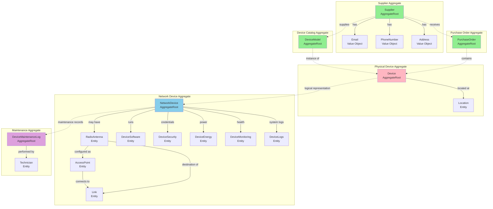
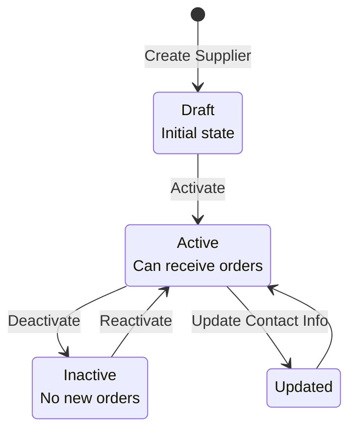
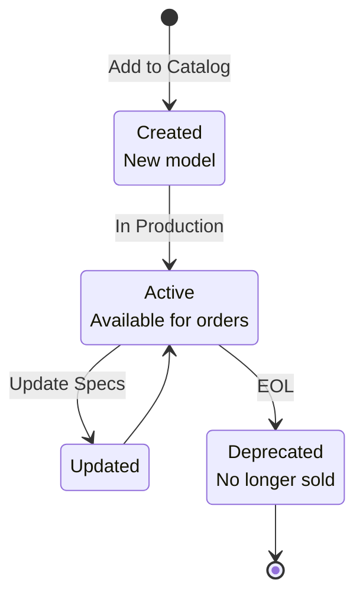
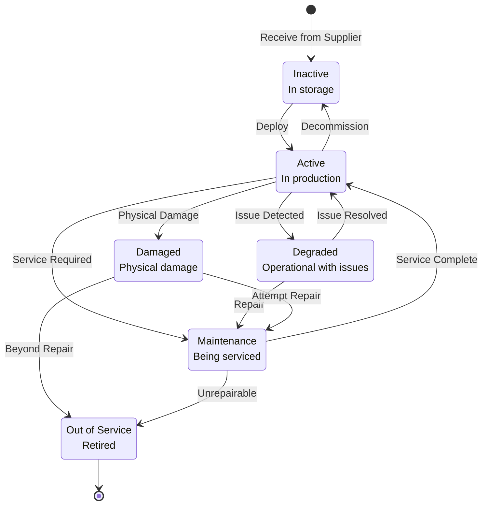
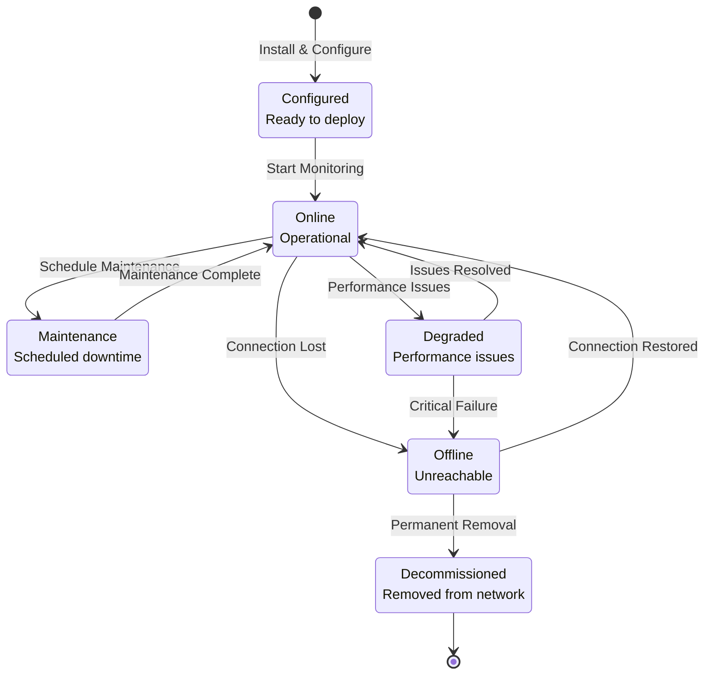
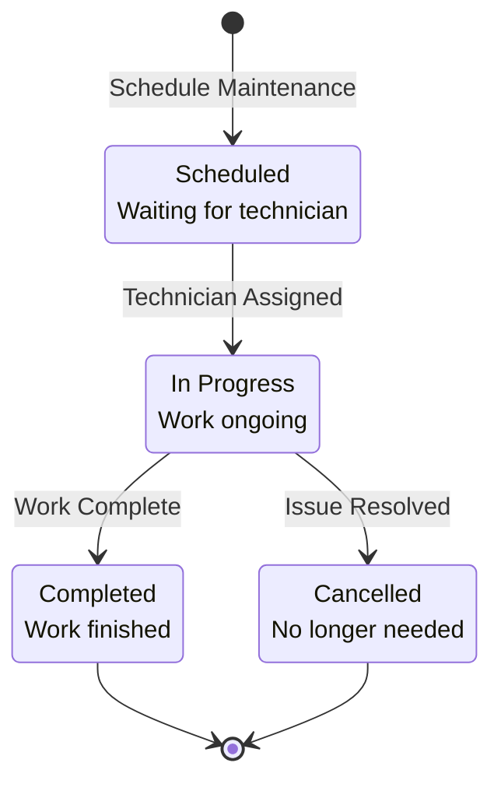

# Domain Model Documentation

## Overview

This document provides a comprehensive description of the domain model for the **Network Monitoring Platform**. The model is organized around **aggregates**, following Domain-Driven Design tactical patterns. Each aggregate represents a consistency boundary with a single root entity that controls access to its children.

## Table of Contents

1. [Domain Model Diagram](#domain-model-diagram)
2. [Supplier Aggregate](#supplier-aggregate)
3. [Device Catalog Aggregate](#device-catalog-aggregate)
4. [Purchase Order Aggregate](#purchase-order-aggregate)
5. [Physical Device Aggregate](#physical-device-aggregate)
6. [Network Device Aggregate](#network-device-aggregate)
7. [Maintenance Aggregate](#maintenance-aggregate)
8. [Value Objects](#value-objects)
9. [Domain Services](#domain-services)
10. [Domain Events](#domain-events)

---

## Domain Model Diagram



---

## Supplier Aggregate

### Aggregate Root: Supplier

**Purpose**: Manages supplier/vendor information for device procurement.

**Responsibilities**:
- Track supplier contact information
- Manage active/inactive status
- Provide supplier details for purchase orders

**File Location**: [src/domain/entities/Supplier.ts](src/domain/entities/Supplier.ts)

### Entities

#### Supplier (Root)

```typescript
interface SupplierProps {
  name: string;
  contactEmail: Email;
  contactPhone: PhoneNumber;
  address: Address;
  website?: string;
  isActive: boolean;
}

class Supplier extends AggregateRoot<SupplierProps> {
  get name(): string;
  get contactEmail(): Email;
  get contactPhone(): PhoneNumber;
  get address(): Address;
  get website(): string | undefined;
  get isActive(): boolean;

  private constructor(props: SupplierProps, id?: UniqueEntityID);

  public static create(props: SupplierProps, id?: UniqueEntityID): Result<Supplier>;

  public activate(): void;
  public deactivate(): void;
  public updateContactInfo(email: Email, phone: PhoneNumber): Result<void>;
}
```

### Value Objects

| Value Object | Type | Description |
|--------------|------|-------------|
| **Email** | Email | RFC-compliant email address |
| **PhoneNumber** | PhoneNumber | E.164 international phone number |
| **Address** | Address | Physical mailing address |

### Rules / Invariants

1. **Name is required**: Supplier name cannot be null or empty
2. **Valid contact email**: Must be a valid RFC-compliant email address
3. **Valid contact phone**: Must be a valid international phone number
4. **Website is optional**: If provided, must be a valid URL
5. **Active status**: Only active suppliers can be assigned to new purchase orders
6. **Immutable ID**: Supplier ID cannot change once created

### Domain Events

```typescript
// Event emitted when supplier is created
class SupplierCreatedEvent extends DomainEvent {
  supplierId: string;
  name: string;
  timestamp: Date;
}

// Event emitted when supplier is deactivated
class SupplierDeactivatedEvent extends DomainEvent {
  supplierId: string;
  reason?: string;
  timestamp: Date;
}

// Event emitted when contact info changes
class SupplierContactUpdatedEvent extends DomainEvent {
  supplierId: string;
  newEmail: string;
  newPhone: string;
  timestamp: Date;
}
```

### Lifecycle Diagram



### Usage Example

```typescript
// Create supplier
const emailResult = Email.create("supplier@example.com");
const phoneResult = PhoneNumber.create("+1234567890");
const addressResult = Address.create({
  street: "123 Main St",
  city: "Springfield",
  province: "IL",
  country: "USA"
});

if (emailResult.isSuccess && phoneResult.isSuccess && addressResult.isSuccess) {
  const supplierResult = Supplier.create({
    name: "ACME Corp",
    contactEmail: emailResult.value,
    contactPhone: phoneResult.value,
    address: addressResult.value,
    website: "https://acme.com",
    isActive: true
  });

  if (supplierResult.isSuccess) {
    const supplier = supplierResult.value;
    // supplier.deactivate();
  }
}
```

---

## Device Catalog Aggregate

### Aggregate Root: DeviceModel

**Purpose**: Represents the catalog of device types available from suppliers.

**Responsibilities**:
- Define device specifications
- Associate with suppliers
- Serve as template for physical devices

**File Location**: [src/domain/entities/DeviceModel.ts](src/domain/entities/DeviceModel.ts) *(currently stub)*

### Entities

#### DeviceModel (Root)

```typescript
interface DeviceModelProps {
  model: string;
  manufacturer: Vendors;
  type: DeviceType;
  operatingSystem?: OperatingSystems;
  specifications?: string;
  supplierId: string;
}

class DeviceModel extends AggregateRoot<DeviceModelProps> {
  get model(): string;
  get manufacturer(): Vendors;
  get type(): DeviceType;
  get operatingSystem(): OperatingSystems | undefined;
  get specifications(): string | undefined;

  public static create(props: DeviceModelProps, id?: UniqueEntityID): Result<DeviceModel>;
  public updateSpecifications(specs: string): void;
}
```

### Value Objects

None (uses enums for type safety)

### Enumerations

**Vendors**:
```
MIKROTIK, UBIQUITI, MIMOSA, CISCO, ARUBA, ARISTA, CAMBIUM,
JUNIPER, HUAWEI, HPE, EXTREME_NETWORKS, RADWIN, CERAGON,
TP_LINK, OTHER
```

**DeviceType**:
```
ROUTER, SWITCH, RADIO, FIREWALL, SERVER, MODEM, ONT, OLT,
WIRELESS, SECURITY, EDGE
```

**OperatingSystems**:
```
IOS, IOS_XE, IOS_XR, NX_OS, JUNOS, EOS, VRP, ARUBAOS,
COMWARE, XOS, EXOS, ROUTEROS, SWITCHOS, EDGEOS, UNIFI_OS,
AIROS, UFIBER_OS, CNMAESTRO_OS, EPMP_OS, MIMOSAOS,
RADWIN_OS, FIBEAIR_OS, PHAROS_OS, OMADA_OS, FORTIOS,
PAN_OS, SOPHOS_OS, GAIA_OS, SONICOS, FIREWARE_OS,
PFSENSE_OS, OPNSENSE_OS
```

### Rules / Invariants

1. **Model name required**: Cannot be empty
2. **Manufacturer required**: Must be from Vendors enum
3. **Device type required**: Must be from DeviceType enum
4. **Unique model per manufacturer**: (model, manufacturer) must be unique
5. **Operating system optional**: Some devices may not have OS information
6. **Must have supplier**: Every model must be associated with at least one supplier

### Domain Events

```typescript
class DeviceModelCreatedEvent extends DomainEvent {
  modelId: string;
  manufacturer: string;
  model: string;
  type: string;
}

class DeviceModelUpdatedEvent extends DomainEvent {
  modelId: string;
  changes: Partial<DeviceModelProps>;
}
```

### Lifecycle Diagram



---

## Purchase Order Aggregate

### Aggregate Root: PurchaseOrder

**Purpose**: Represents a purchase transaction for acquiring devices.

**Responsibilities**:
- Track device purchases
- Associate devices with suppliers
- Maintain purchase history

### Entities

#### PurchaseOrder (Root)

```typescript
interface PurchaseOrderProps {
  orderNumber: string;
  date: Date;
  observations?: string;
  totalPrice: number;
  supplierId: string;
}

class PurchaseOrder extends AggregateRoot<PurchaseOrderProps> {
  get orderNumber(): string;
  get date(): Date;
  get observations(): string | undefined;
  get totalPrice(): number;
  get supplierId(): string;

  public static create(props: PurchaseOrderProps, id?: UniqueEntityID): Result<PurchaseOrder>;
  public addObservation(note: string): void;
}
```

### Rules / Invariants

1. **Unique order number**: Order number must be unique across all orders
2. **Valid date**: Order date cannot be in the future
3. **Positive price**: Total price must be greater than zero
4. **Active supplier**: Supplier must be active at time of order creation
5. **At least one device**: Purchase order must contain at least one device

### Domain Events

```typescript
class PurchaseOrderCreatedEvent extends DomainEvent {
  orderId: string;
  orderNumber: string;
  supplierId: string;
  totalPrice: number;
}

class PurchaseOrderReceivedEvent extends DomainEvent {
  orderId: string;
  receivedDate: Date;
  deviceIds: string[];
}
```

---

## Physical Device Aggregate

### Aggregate Root: Device

**Purpose**: Represents physical hardware assets.

**Responsibilities**:
- Track physical device lifecycle
- Manage warranty information
- Associate with location and owner

### Entities

#### Device (Root)

```typescript
interface DeviceProps {
  status: DeviceStatus;
  owner: DeviceOwner;
  serialNumber: string;
  guaranteeEndDate?: Date;
  deviceModelId: string;
  purchaseOrderId: string;
  locationId: string;
}

class Device extends AggregateRoot<DeviceProps> {
  get status(): DeviceStatus;
  get owner(): DeviceOwner;
  get serialNumber(): string;
  get guaranteeEndDate(): Date | undefined;
  get isUnderWarranty(): boolean;

  public static create(props: DeviceProps, id?: UniqueEntityID): Result<Device>;

  public activate(): void;
  public deactivate(): void;
  public markAsDamaged(): void;
  public sendToMaintenance(): void;
  public updateLocation(locationId: string): void;
}
```

#### Location (Child Entity)

```typescript
interface LocationProps {
  coordinates: string; // Lat, Long
  city: string;
  neighborhood: string;
  address?: string;
}

class Location extends Entity<LocationProps> {
  get coordinates(): string;
  get city(): string;
  get neighborhood(): string;
  get address(): string | undefined;

  public static create(props: LocationProps, id?: UniqueEntityID): Result<Location>;
  public getLatitude(): number;
  public getLongitude(): number;
}
```

### Enumerations

**DeviceStatus**:
```
ACTIVE       - Currently in use
INACTIVE     - Not in use
DEGRADED     - Operating with issues
MAINTENANCE  - Under maintenance
OUT_OF_SERVICE - Permanently removed
DAMAGED      - Physically damaged
```

**DeviceOwner**:
```
COMPANY      - Owned by ISP
CLIENT       - Customer premises equipment
THIRD_PARTY  - Owned by partner/vendor
```

### Rules / Invariants

1. **Unique serial number**: Serial number must be unique across all devices
2. **Valid status transitions**: Not all status changes are allowed (see diagram)
3. **Location required when active**: Active devices must have a location
4. **Warranty validation**: Guarantee end date must be after purchase date
5. **Device model required**: Every device must reference a valid model
6. **Purchase order required**: Every device must be associated with a purchase order

### Domain Events

```typescript
class DeviceActivatedEvent extends DomainEvent {
  deviceId: string;
  serialNumber: string;
  locationId: string;
}

class DeviceDeactivatedEvent extends DomainEvent {
  deviceId: string;
  reason?: string;
}

class DeviceDamagedEvent extends DomainEvent {
  deviceId: string;
  damageDescription: string;
  reportedBy?: string;
}

class DeviceLocationChangedEvent extends DomainEvent {
  deviceId: string;
  oldLocationId: string;
  newLocationId: string;
}
```

### Lifecycle Diagram



---

## Network Device Aggregate

### Aggregate Root: NetworkDevice

**Purpose**: Represents the logical network node (configuration, connectivity, monitoring).

**Responsibilities**:
- Manage network configuration
- Track operational status
- Store monitoring metrics
- Maintain security credentials
- Record maintenance history

**File Location**: [src/domain/entities/NetworkDevice.ts](src/domain/entities/NetworkDevice.ts) *(currently stub)*

### Entities

#### NetworkDevice (Root)

```typescript
interface NetworkDeviceProps {
  name: string;
  type: NetworkDeviceRole;
  description?: string;
  installDate: Date;
  ipAddress: string;
  macAddress: string;
  connectivityType: ConnectivityType;
  managementProtocol: ManagementProtocol;
  managementPort: number;
  enabledRemoteAccess: boolean;
  deviceId: string; // Reference to physical device
}

class NetworkDevice extends AggregateRoot<NetworkDeviceProps> {
  get name(): string;
  get type(): NetworkDeviceRole;
  get ipAddress(): string;
  get macAddress(): string;
  get isOnline(): boolean;

  public static create(props: NetworkDeviceProps, id?: UniqueEntityID): Result<NetworkDevice>;

  public updateConfiguration(config: Partial<NetworkDeviceProps>): Result<void>;
  public enableRemoteAccess(): void;
  public disableRemoteAccess(): void;
  public recordMetrics(metrics: DeviceMetrics): void;
}
```

#### RadioAntenna (Child Entity)

```typescript
interface RadioAntennaProps {
  power?: number; // Watts
  antennaGain?: number; // dBi
  height?: number; // Meters
  frequencyRange?: string; // e.g., "5GHz"
  type: RadioType;
  networkDeviceId: string;
}

class RadioAntenna extends Entity<RadioAntennaProps> {
  get power(): number | undefined;
  get antennaGain(): number | undefined;
  get height(): number | undefined;
  get frequencyRange(): string | undefined;
  get type(): RadioType;

  public static create(props: RadioAntennaProps, id?: UniqueEntityID): Result<RadioAntenna>;
  public updatePower(watts: number): Result<void>;
  public updateHeight(meters: number): Result<void>;
}
```

#### AccessPoint (Child Entity)

```typescript
interface AccessPointProps {
  ssid: string;
  frequencyChannel?: number;
  bandwidth?: number; // MHz
  ptpMode: boolean; // Point-to-point mode
  password?: string;
  radioAntennaId: string;
}

class AccessPoint extends Entity<AccessPointProps> {
  get ssid(): string;
  get frequencyChannel(): number | undefined;
  get bandwidth(): number | undefined;
  get isPtP(): boolean;

  public static create(props: AccessPointProps, id?: UniqueEntityID): Result<AccessPoint>;
  public changeSSID(newSSID: string): void;
  public setChannel(channel: number): Result<void>;
  public enablePtPMode(): void;
  public disablePtPMode(): void;
}
```

#### Link (Child Entity)

```typescript
interface LinkProps {
  name: string;
  description?: string;
  rxThroughput: number; // Mbps
  txThroughput: number; // Mbps
  rxSignalStrength?: number; // dBm
  txSignalStrength?: number; // dBm
  latency?: number; // ms
  distance?: number; // km
  sourceDeviceId: string; // AccessPoint ID
  destinationDeviceId: string; // RadioAntenna ID
}

class Link extends Entity<LinkProps> {
  get name(): string;
  get rxThroughput(): number;
  get txThroughput(): number;
  get latency(): number | undefined;
  get distance(): number | undefined;

  public static create(props: LinkProps, id?: UniqueEntityID): Result<Link>;
  public updateThroughput(rx: number, tx: number): void;
  public updateSignalStrength(rx: number, tx: number): void;
}
```

#### DeviceSoftware (Child Entity)

```typescript
interface DeviceSoftwareProps {
  version: string;
  releaseDate: Date;
  lastUpdateDate?: Date;
  backupLink?: string; // URL to firmware backup
  networkDeviceId: string;
}

class DeviceSoftware extends Entity<DeviceSoftwareProps> {
  get version(): string;
  get releaseDate(): Date;
  get lastUpdateDate(): Date | undefined;
  get isOutdated(): boolean;

  public static create(props: DeviceSoftwareProps, id?: UniqueEntityID): Result<DeviceSoftware>;
  public upgrade(newVersion: string, releaseDate: Date): void;
  public recordUpdate(): void;
}
```

#### DeviceSecurity (Child Entity)

```typescript
interface DeviceSecurityProps {
  username: string;
  password: string; // Should be encrypted
  SNMPPassword?: string; // SNMP community string or v3 password
  networkDeviceId: string;
}

class DeviceSecurity extends Entity<DeviceSecurityProps> {
  get username(): string;
  // password and SNMPPassword are write-only

  public static create(props: DeviceSecurityProps, id?: UniqueEntityID): Result<DeviceSecurity>;
  public updatePassword(newPassword: string): void;
  public updateSNMPPassword(newPassword: string): void;
  public rotateCredentials(): void;
}
```

#### DeviceEnergy (Child Entity)

```typescript
interface DeviceEnergyProps {
  sourceType: EnergySourceType;
  powerConsumption: number; // Watts
  voltage: number; // Volts
  current: number; // Amperes
  backUpEnergy: EnergySourceType;
  networkDeviceId: string;
}

class DeviceEnergy extends Entity<DeviceEnergyProps> {
  get sourceType(): EnergySourceType;
  get powerConsumption(): number;
  get voltage(): number;
  get current(): number;
  get hasBackup(): boolean;

  public static create(props: DeviceEnergyProps, id?: UniqueEntityID): Result<DeviceEnergy>;
  public updateMetrics(voltage: number, current: number): void;
  public switchToBackup(): void;
}
```

#### DeviceMonitoring (Child Entity)

```typescript
interface DeviceMonitoringProps {
  uptime: number; // Seconds
  temperature: number; // Celsius
  status: NetworkDeviceStatus;
  avgLatency: number; // ms
  packetsLost: number; // percentage
  rxThroughput: number; // Mbps
  txThroughput: number; // Mbps
  alertsEnabled: boolean;
  lastMonitoring: Date;
  cpuUsage: number; // percentage
  memoryUsage: number; // percentage
  diskUsage: number; // percentage
  networkDeviceId: string;
}

class DeviceMonitoring extends Entity<DeviceMonitoringProps> {
  get uptime(): number;
  get temperature(): number;
  get status(): NetworkDeviceStatus;
  get avgLatency(): number;
  get packetsLost(): number;
  get isHealthy(): boolean;

  public static create(props: DeviceMonitoringProps, id?: UniqueEntityID): Result<DeviceMonitoring>;
  public updateMetrics(metrics: Partial<DeviceMonitoringProps>): void;
  public enableAlerts(): void;
  public disableAlerts(): void;
}
```

#### DeviceLogs (Child Entity)

```typescript
interface DeviceLogsProps {
  timestamp: Date;
  logLevel: LogLevel;
  message: string;
  networkDeviceId: string;
}

class DeviceLogs extends Entity<DeviceLogsProps> {
  get timestamp(): Date;
  get logLevel(): LogLevel;
  get message(): string;

  public static create(props: DeviceLogsProps, id?: UniqueEntityID): Result<DeviceLogs>;
}
```

### Enumerations

**NetworkDeviceRole**:
```
ROUTING, SWITCHING, WIRELESS_ACCESS, WIRELESS_CONTROLLER,
WIRELESS_BRIDGE, RADIO_LINK, BACKHAUL, FIREWALL, IDS, IPS,
UTM, VPN, NAC, AUTHENTICATION, APPLICATION_HOSTING,
DATABASE_HOSTING, PROXY, DHCP, DNS, LOAD_BALANCING, CDN,
LOGGING, MONITORING, SNMP, OOB_MANAGEMENT, KVM_ACCESS,
ENVIRONMENT_MONITORING, POWER_MANAGEMENT
```

**NetworkDeviceStatus**:
```
ONLINE      - Device is reachable
OFFLINE     - Device is unreachable
MAINTENANCE - Scheduled maintenance
```

**ConnectivityType**:
```
ETHERNET, FIBER_OPTIC, WIRELESS, DSL, SATELLITE, OTHER
```

**ManagementProtocol**:
```
SNMP, SSH, TELNET, HTTP, HTTPS, OTHER
```

**RadioType**:
```
ACCESS_POINT, PTP_RADIO, PTMP_RADIO, SECTOR_ANTENNA,
BACKHAUL_RADIO, MIMO_RADIO, STATION
```

**LogLevel**:
```
INFO, WARNING, ERROR, CRITICAL
```

**EnergySourceType**:
```
SOLAR, BATTERY, MAINS, GENERATOR, POE, OTHER
```

### Rules / Invariants

1. **Unique IP address**: IP address must be unique across all network devices
2. **Unique MAC address**: MAC address must be unique across all network devices
3. **Valid management port**: Port must be 1-65535
4. **Physical device required**: Must reference a valid physical device
5. **Monitoring data consistency**: Status in monitoring must match polling results
6. **Credentials required for remote access**: If remote access enabled, must have security credentials
7. **Temperature limits**: Temperature must be -40°C to 85°C (typical operating range)
8. **Packet loss range**: Packet loss must be 0-100%
9. **CPU/Memory/Disk usage range**: Must be 0-100%

### Domain Events

```typescript
class NetworkDeviceCreatedEvent extends DomainEvent {
  networkDeviceId: string;
  name: string;
  ipAddress: string;
  type: NetworkDeviceRole;
}

class NetworkDeviceOnlineEvent extends DomainEvent {
  networkDeviceId: string;
  timestamp: Date;
}

class NetworkDeviceOfflineEvent extends DomainEvent {
  networkDeviceId: string;
  timestamp: Date;
  consecutiveFailures: number;
}

class DeviceMetricsCollectedEvent extends DomainEvent {
  networkDeviceId: string;
  metrics: DeviceMonitoringProps;
  timestamp: Date;
}

class HighLatencyDetectedEvent extends DomainEvent {
  networkDeviceId: string;
  latency: number;
  threshold: number;
}

class HighPacketLossDetectedEvent extends DomainEvent {
  networkDeviceId: string;
  packetLoss: number;
  threshold: number;
}

class HighTemperatureAlertEvent extends DomainEvent {
  networkDeviceId: string;
  temperature: number;
  threshold: number;
}

class DeviceConfigurationChangedEvent extends DomainEvent {
  networkDeviceId: string;
  changes: Partial<NetworkDeviceProps>;
  changedBy?: string;
}

class RemoteAccessEnabledEvent extends DomainEvent {
  networkDeviceId: string;
  protocol: ManagementProtocol;
  enabledBy?: string;
}
```

### Lifecycle Diagram



---

## Maintenance Aggregate

### Aggregate Root: DeviceMaintenanceLog

**Purpose**: Records maintenance activities performed on network devices.

**Responsibilities**:
- Track maintenance history
- Associate technicians with work
- Categorize maintenance types
- Provide audit trail

### Entities

#### DeviceMaintenanceLog (Root)

```typescript
interface DeviceMaintenanceLogProps {
  date: Date;
  description: string;
  type: MaintenanceType;
  performedById: string; // Technician ID
  networkDeviceId: string;
}

class DeviceMaintenanceLog extends AggregateRoot<DeviceMaintenanceLogProps> {
  get date(): Date;
  get description(): string;
  get type(): MaintenanceType;
  get performedById(): string;
  get networkDeviceId(): string;

  public static create(props: DeviceMaintenanceLogProps, id?: UniqueEntityID): Result<DeviceMaintenanceLog>;
  public updateDescription(description: string): void;
}
```

#### Technician (Entity)

```typescript
interface TechnicianProps {
  name: string;
  contactInfo?: string;
}

class Technician extends Entity<TechnicianProps> {
  get name(): string;
  get contactInfo(): string | undefined;

  public static create(props: TechnicianProps, id?: UniqueEntityID): Result<Technician>;
  public updateContactInfo(contact: string): void;
}
```

### Enumerations

**MaintenanceType**:
```
PREVENTIVE   - Scheduled preventive maintenance
CORRECTIVE   - Repair after failure
PREDICTIVE   - Based on predictive analytics
EMERGENCY    - Urgent unplanned maintenance
```

### Rules / Invariants

1. **Date cannot be future**: Maintenance date cannot be in the future
2. **Description required**: Maintenance description cannot be empty
3. **Valid technician**: Technician must exist in the system
4. **Valid network device**: Network device must exist
5. **Type required**: Maintenance type must be specified

### Domain Events

```typescript
class MaintenanceScheduledEvent extends DomainEvent {
  maintenanceId: string;
  networkDeviceId: string;
  scheduledDate: Date;
  type: MaintenanceType;
  technicianId: string;
}

class MaintenanceCompletedEvent extends DomainEvent {
  maintenanceId: string;
  networkDeviceId: string;
  completedDate: Date;
  notes: string;
}

class EmergencyMaintenanceRequestedEvent extends DomainEvent {
  networkDeviceId: string;
  issue: string;
  priority: string;
}
```

### Lifecycle Diagram



---

## Value Objects

### Email

**File**: [src/domain/value-objects/Email.ts](src/domain/value-objects/Email.ts)

**Purpose**: Encapsulates email addresses with RFC compliance validation.

```typescript
interface EmailProps {
  value: string;
}

class Email extends ValueObject<EmailProps> {
  private static readonly MAX_LENGTH = 320;
  private static readonly LOCAL_PART_MAX = 64;
  private static readonly DOMAIN_MAX = 255;

  private constructor(props: EmailProps);

  get value(): string;

  public static create(email: string): Result<Email>;
  public toString(): string;
}
```

**Invariants**:
- Total length ≤ 320 characters
- Local part ≤ 64 characters
- Domain part ≤ 255 characters
- Must match RFC email format: `[localpart]@[domain].[tld]`
- Normalized (trimmed, lowercase)

**Usage**:
```typescript
const emailResult = Email.create("user@example.com");
if (emailResult.isSuccess) {
  const email = emailResult.value;
  console.log(email.toString()); // "user@example.com"
}
```

---

### PhoneNumber

**File**: [src/domain/value-objects/PhoneNumber.ts](src/domain/value-objects/PhoneNumber.ts)

**Purpose**: International phone number validation and formatting.

```typescript
interface PhoneNumberProps {
  value: string;          // E.164 format: +1234567890
  countryCode: string;    // e.g., "US"
  nationalNumber: string; // e.g., "234567890"
  country?: string;       // e.g., "United States"
  type?: string;          // "MOBILE" | "FIXED_LINE" | "UNKNOWN"
}

class PhoneNumber extends ValueObject<PhoneNumberProps> {
  private constructor(props: PhoneNumberProps);

  get value(): string;
  get countryCode(): string;
  get nationalNumber(): string;
  get type(): string | undefined;

  public static create(phoneNumber: string, defaultCountry?: string): Result<PhoneNumber>;

  public isMobile(): boolean;
  public isFixedLine(): boolean;
  public canReceiveSMS(): boolean;
  public formatFor(country: string): string;
  public toE164(): string;
  public toURI(): string; // tel:+1234567890
}
```

**Features**:
- Uses `libphonenumber-js` for validation
- Supports international formats
- Stores in E.164 format (+[country][number])
- Type detection (mobile vs fixed-line)
- Country-specific formatting
- SMS capability detection

**Usage**:
```typescript
const phoneResult = PhoneNumber.create("+1 (234) 567-8900", "US");
if (phoneResult.isSuccess) {
  const phone = phoneResult.value;
  console.log(phone.toE164());           // "+12345678900"
  console.log(phone.formatFor("US"));    // "(234) 567-8900"
  console.log(phone.isMobile());         // true/false
  console.log(phone.canReceiveSMS());    // true/false
}
```

---

### Address

**File**: [src/domain/value-objects/Address.ts](src/domain/value-objects/Address.ts)

**Purpose**: Comprehensive address representation.

```typescript
interface AddressProps {
  street: string;
  houseNumber?: string;
  city: string;
  province: string;
  postalCode?: string;
  country: string;
  complement?: string;
  neighborhood?: string;
}

class Address extends ValueObject<AddressProps> {
  private constructor(props: AddressProps);

  get street(): string;
  get houseNumber(): string | undefined;
  get city(): string;
  get province(): string;
  get postalCode(): string | undefined;
  get country(): string;

  public static create(props: AddressProps): Result<Address>;

  public getFullAddress(): string;
  public getShortAddress(): string;
}
```

**Invariants**:
- Street is required
- City is required
- Province/state is required
- Country is required
- All string fields trimmed

**Usage**:
```typescript
const addressResult = Address.create({
  street: "123 Main St",
  houseNumber: "Apt 4B",
  city: "Springfield",
  province: "IL",
  postalCode: "62701",
  country: "USA",
  neighborhood: "Downtown"
});

if (addressResult.isSuccess) {
  const address = addressResult.value;
  console.log(address.getFullAddress());
  // "123 Main St, Apt 4B, Downtown, Springfield, IL 62701, USA"

  console.log(address.getShortAddress());
  // "Springfield, IL, USA"
}
```

---

## Domain Services

Domain services contain business logic that doesn't naturally fit in a single entity.

### PollingStrategyService

**Purpose**: Determine optimal polling strategy based on device characteristics.

**Planned Implementation**:
```typescript
interface PollingStrategyService {
  determinePollingInterval(device: NetworkDevice): number;
  selectProtocol(device: NetworkDevice): ManagementProtocol;
  calculateRetryBackoff(consecutiveFailures: number): number;
}
```

**Business Rules**:
- Critical devices (firewalls, core routers): 10 second interval
- Standard devices: 30 second interval
- Low-priority devices: 60 second interval
- Devices with high failure rate: Exponential backoff

---

### AlertEvaluationService

**Purpose**: Evaluate device metrics against thresholds to determine if alerts should be triggered.

**Planned Implementation**:
```typescript
interface AlertEvaluationService {
  shouldAlert(metrics: DeviceMonitoringProps, thresholds: AlertThresholds): boolean;
  determineAlertSeverity(metrics: DeviceMonitoringProps): AlertSeverity;
  groupRelatedAlerts(alerts: Alert[]): AlertGroup[];
}
```

**Business Rules**:
- Latency > 100ms for 5 minutes: Warning
- Latency > 500ms: Critical
- Packet loss > 5%: Warning
- Packet loss > 30%: Critical
- Temperature > 70°C: Warning
- Temperature > 80°C: Critical
- CPU > 80% for 10 minutes: Warning
- CPU > 95%: Critical

---

### NetworkTopologyService

**Purpose**: Calculate network topology and dependencies.

**Planned Implementation**:
```typescript
interface NetworkTopologyService {
  calculateDeviceDependencies(deviceId: string): NetworkDevice[];
  findCriticalPath(sourceId: string, destId: string): NetworkDevice[];
  identifySinglePointsOfFailure(): NetworkDevice[];
}
```

**Business Rules**:
- Identify devices that, if failed, would isolate other devices
- Calculate number of hops between devices
- Determine redundancy level

---

## Domain Events

### Event Catalog

| Event | Trigger | Aggregate | Consumers |
|-------|---------|-----------|-----------|
| **SupplierCreatedEvent** | Supplier created | Supplier | Audit Log |
| **SupplierDeactivatedEvent** | Supplier deactivated | Supplier | Notification, Audit |
| **DeviceModelCreatedEvent** | Model added to catalog | DeviceModel | Catalog Service |
| **PurchaseOrderCreatedEvent** | Order placed | PurchaseOrder | Inventory, Accounting |
| **DeviceActivatedEvent** | Device deployed | Device | Inventory, Monitoring |
| **DeviceLocationChangedEvent** | Device relocated | Device | Mapping, Inventory |
| **NetworkDeviceCreatedEvent** | Network device configured | NetworkDevice | Monitoring, Mapping |
| **NetworkDeviceOnlineEvent** | Device responds to poll | NetworkDevice | Dashboard, Notification |
| **NetworkDeviceOfflineEvent** | Device fails to respond | NetworkDevice | Alert System, Dashboard |
| **DeviceMetricsCollectedEvent** | Polling completes | NetworkDevice | Analytics, Dashboard |
| **HighLatencyDetectedEvent** | Latency exceeds threshold | NetworkDevice | Alert System |
| **HighPacketLossDetectedEvent** | Packet loss exceeds threshold | NetworkDevice | Alert System |
| **HighTemperatureAlertEvent** | Temperature too high | NetworkDevice | Alert System |
| **DeviceConfigurationChangedEvent** | Config updated | NetworkDevice | Audit, Backup |
| **MaintenanceScheduledEvent** | Maintenance created | MaintenanceLog | Technician Assignment |
| **MaintenanceCompletedEvent** | Maintenance finished | MaintenanceLog | Device Status Update |

### Event Processing Patterns

**Synchronous (Within Aggregate)**:
- Validation events
- State transitions
- Invariant checks

**Asynchronous (Cross-Aggregate)**:
- Notifications
- Analytics updates
- Dashboard updates
- Audit logging

**Event Replay**:
- All domain events are persisted
- Can rebuild aggregate state from events
- Supports event sourcing migration

---

## Summary

The domain model is organized around **7 primary aggregates**:

1. **Supplier** - Vendor management
2. **DeviceModel** - Product catalog
3. **PurchaseOrder** - Procurement
4. **Device** - Physical hardware
5. **NetworkDevice** - Logical network nodes (primary monitoring aggregate)
6. **MaintenanceLog** - Service records
7. **Technician** - Service personnel

**Value Objects** ensure type safety for:
- Email addresses (RFC compliance)
- Phone numbers (international format)
- Addresses (structured location data)

**Domain Events** enable:
- Decoupled communication
- Audit trail
- Event-driven workflows
- Future event sourcing

The model enforces **strong invariants** through:
- Guard validations
- Result pattern
- Aggregate boundaries
- Explicit business rules

This design provides a solid foundation for **long-term evolution** while maintaining **business logic integrity** and **data consistency**.

---

**Document Version**: 1.0
**Last Updated**: 2025-12-03
**Maintainer**: Domain Team
