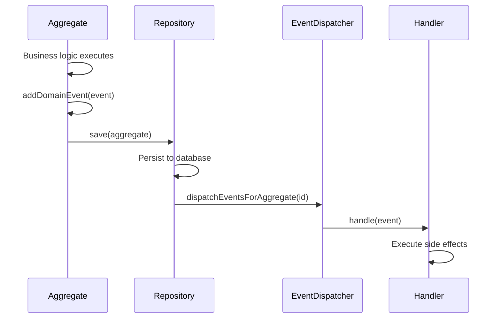
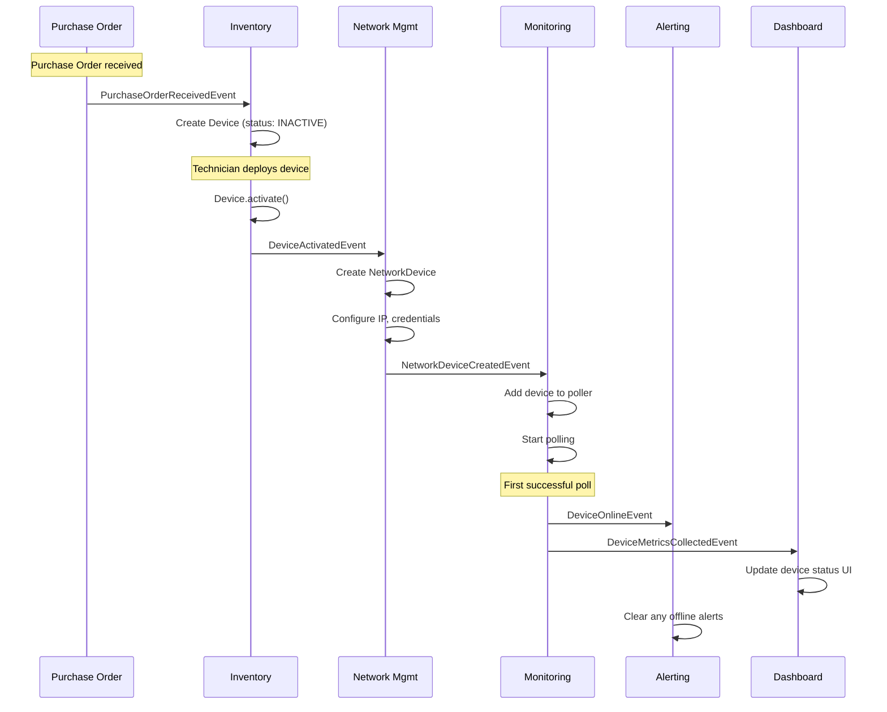
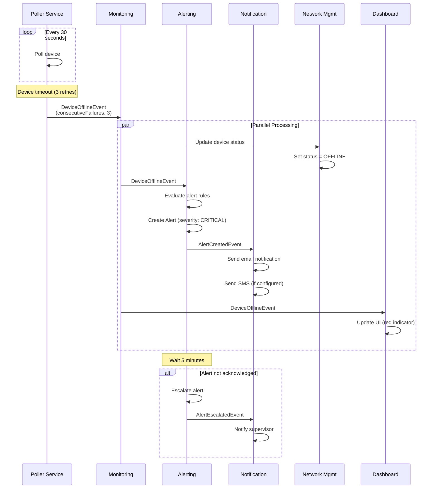
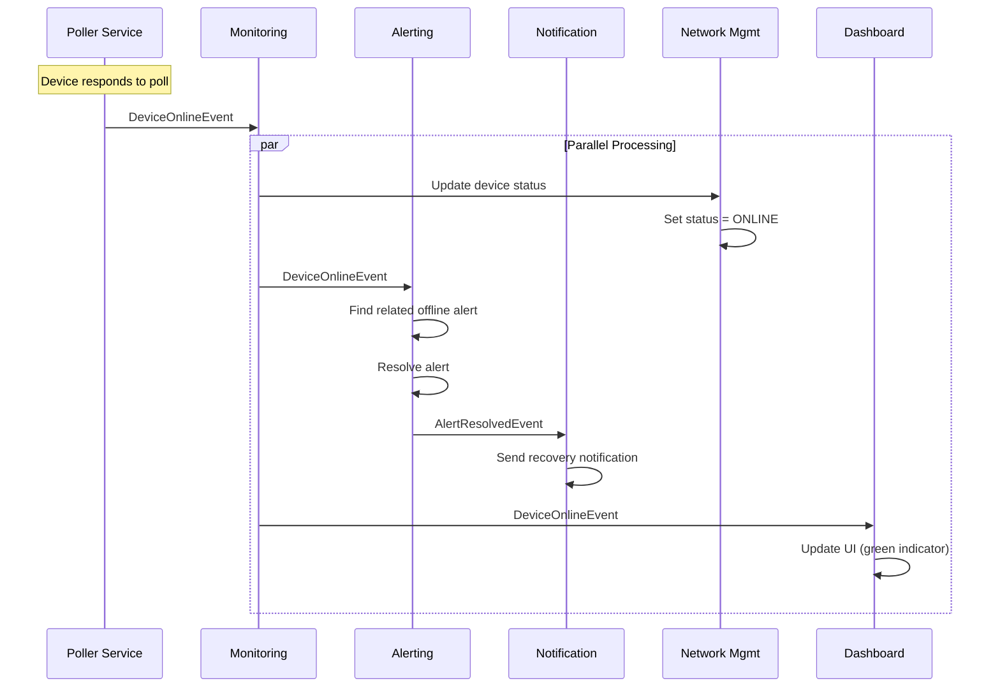
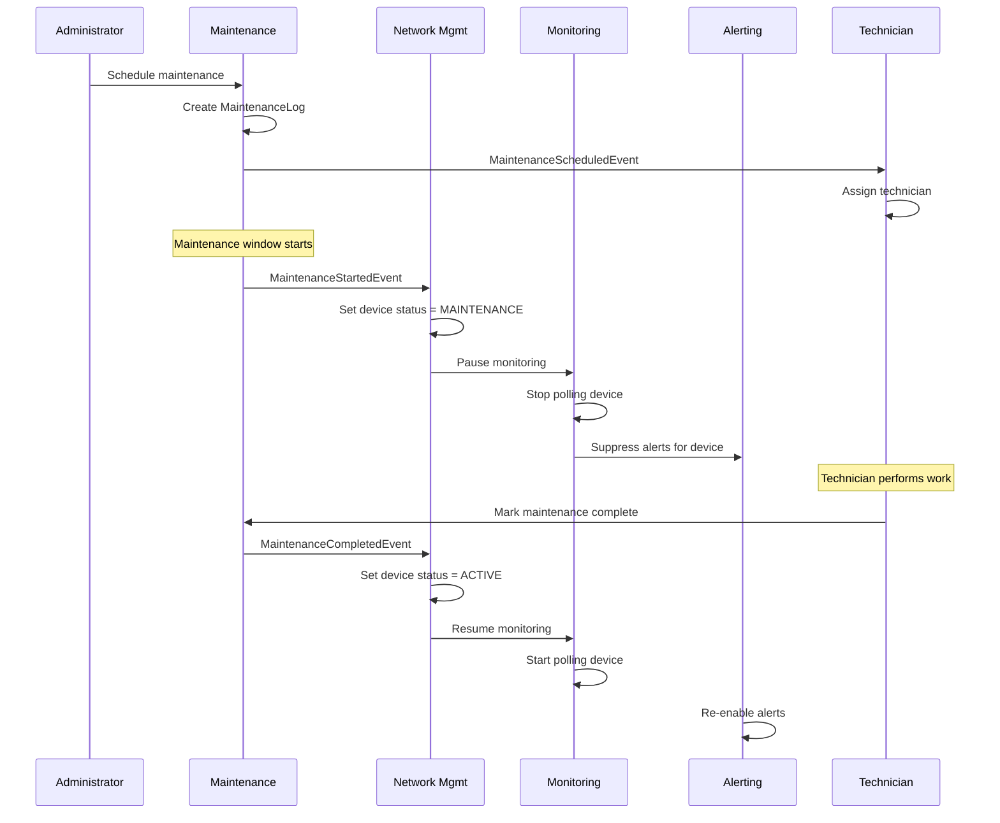
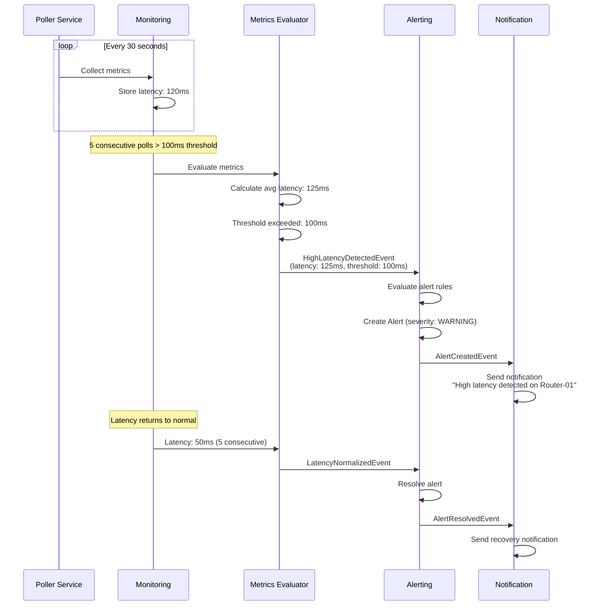
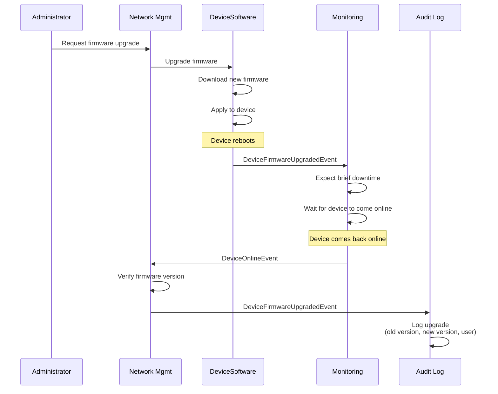

# Event Flows & Domain Events

## Overview

This document describes all **Domain Events** in the Network Monitoring Platform, their triggers, producers, consumers, side effects, and complete event flows. Events are the primary mechanism for **decoupled communication** between bounded contexts and enable **event-driven architecture**.

---

## Table of Contents

1. [Event Architecture](#event-architecture)
2. [Event Catalog](#event-catalog)
3. [Event Flows by Business Process](#event-flows-by-business-process)
4. [Event Schemas](#event-schemas)
5. [Event Handlers](#event-handlers)
6. [Event Sourcing Strategy](#event-sourcing-strategy)
7. [Error Handling & Retry](#error-handling--retry)
8. [Idempotency](#idempotency)

---

## Event Architecture

### Event Dispatcher

The system uses a **Domain Event Dispatcher** to manage event publishing and subscription.

**File**: [src/domain/shared/kernel/EventDispatcher.ts](src/domain/shared/kernel/EventDispatcher.ts)

```typescript
export class EventDispatcher {
  private static handlers: Map<string, DomainEventHandler[]> =
    new Map();
  private static markedAggregates: AggregateRoot<any>[] = [];

  // Register event handler
  public static register(
    eventClassName: string,
    handler: DomainEventHandler
  ): void {
    if (!this.handlers.has(eventClassName)) {
      this.handlers.set(eventClassName, []);
    }
    this.handlers.get(eventClassName)!.push(handler);
  }

  // Mark aggregate for dispatch
  public static markAggregateForDispatch(
    aggregate: AggregateRoot<any>
  ): void {
    this.markedAggregates.push(aggregate);
  }

  // Dispatch events for specific aggregate
  public static dispatchEventsForAggregate(id: UniqueEntityID): void {
    const aggregate = this.markedAggregates.find((a) =>
      a.id.equals(id)
    );

    if (aggregate) {
      aggregate
        .getEventDispatcher()
        .forEach((event) => this.dispatch(event));
      aggregate.clearEvents();
    }
  }

  // Dispatch single event
  private static dispatch(event: DomainEvent): void {
    const eventClassName = event.constructor.name;
    const handlers = this.handlers.get(eventClassName) || [];

    handlers.forEach((handler) => handler.handle(event));
  }
}
```

---

### Event Flow Pattern



**Key Principles**:

1. Events are added to aggregate during business logic
2. Events are NOT dispatched until after persistence succeeds
3. This ensures consistency—events only fire if changes are saved
4. Handlers execute side effects (send notifications, update read models, etc.)

---

## Event Catalog

### Device Catalog Context Events

| Event                           | Trigger                    | Producer    | Consumers                 | Side Effects                                |
| ------------------------------- | -------------------------- | ----------- | ------------------------- | ------------------------------------------- |
| **SupplierCreatedEvent**        | Supplier created           | Supplier    | Audit Log                 | Log creation                                |
| **SupplierDeactivatedEvent**    | Supplier deactivated       | Supplier    | Notification, Procurement | Notify procurement team, prevent new orders |
| **SupplierContactUpdatedEvent** | Contact info changed       | Supplier    | Audit Log                 | Log change                                  |
| **DeviceModelCreatedEvent**     | New model added to catalog | DeviceModel | Inventory, Notification   | Make available for purchase orders          |
| **DeviceModelUpdatedEvent**     | Model specs updated        | DeviceModel | Inventory, Audit          | Update existing devices with new specs      |

---

### Inventory Context Events

| Event                           | Trigger                     | Producer      | Consumers                      | Side Effects                              |
| ------------------------------- | --------------------------- | ------------- | ------------------------------ | ----------------------------------------- |
| **PurchaseOrderCreatedEvent**   | Purchase order placed       | PurchaseOrder | Accounting, Audit              | Record expense, notify supplier           |
| **PurchaseOrderReceivedEvent**  | Devices received            | PurchaseOrder | Inventory                      | Add devices to inventory                  |
| **DeviceActivatedEvent**        | Device deployed             | Device        | Network Management, Monitoring | Create NetworkDevice, start monitoring    |
| **DeviceDeactivatedEvent**      | Device removed from service | Device        | Monitoring, Network Management | Stop monitoring, remove from network      |
| **DeviceLocationChangedEvent**  | Device relocated            | Device        | Mapping, Network Management    | Update maps, update network topology      |
| **DeviceDamagedEvent**          | Device physically damaged   | Device        | Maintenance, Inventory         | Create work order, update status          |
| **DeviceWarrantyExpiringEvent** | Warranty expires soon       | Device        | Procurement                    | Consider extended warranty or replacement |

---

### Network Management Context Events

| Event                               | Trigger                    | Producer       | Consumers                 | Side Effects                                 |
| ----------------------------------- | -------------------------- | -------------- | ------------------------- | -------------------------------------------- |
| **NetworkDeviceCreatedEvent**       | Network device configured  | NetworkDevice  | Monitoring, Audit         | Start monitoring, log creation               |
| **NetworkDeviceDeletedEvent**       | Network device removed     | NetworkDevice  | Monitoring, Audit         | Stop monitoring, log deletion                |
| **DeviceConfigurationChangedEvent** | Config updated             | NetworkDevice  | Backup, Audit, Monitoring | Backup config, log change, adjust monitoring |
| **RemoteAccessEnabledEvent**        | Remote management enabled  | NetworkDevice  | Security, Audit           | Log security event                           |
| **RemoteAccessDisabledEvent**       | Remote management disabled | NetworkDevice  | Security, Audit           | Log security event                           |
| **DeviceCredentialsRotatedEvent**   | Credentials changed        | DeviceSecurity | Monitoring, Audit         | Update poller credentials, log change        |
| **DeviceFirmwareUpgradedEvent**     | Firmware updated           | DeviceSoftware | Audit, Monitoring         | Log upgrade, verify device functionality     |
| **LinkEstablishedEvent**            | PtP link created           | Link           | Topology, Monitoring      | Update topology map, monitor link            |
| **LinkFailedEvent**                 | PtP link down              | Link           | Alerting, Topology        | Trigger alert, update topology               |

---

### Monitoring Context Events (CORE)

| Event                           | Trigger                       | Producer         | Consumers                               | Side Effects                                  |
| ------------------------------- | ----------------------------- | ---------------- | --------------------------------------- | --------------------------------------------- |
| **DeviceOnlineEvent**           | Device responds to poll       | PollerService    | Alerting, Dashboard, Network Management | Clear alerts, update UI, set status ONLINE    |
| **DeviceOfflineEvent**          | Device fails to respond       | PollerService    | Alerting, Dashboard, Network Management | Trigger alert, update UI, set status OFFLINE  |
| **DeviceMetricsCollectedEvent** | Polling completes             | PollerService    | Analytics, Dashboard, Alerting          | Store metrics, update UI, evaluate thresholds |
| **HighLatencyDetectedEvent**    | Latency exceeds threshold     | MetricsEvaluator | Alerting                                | Trigger latency alert                         |
| **HighPacketLossDetectedEvent** | Packet loss exceeds threshold | MetricsEvaluator | Alerting                                | Trigger packet loss alert                     |
| **HighTemperatureAlertEvent**   | Temperature too high          | MetricsEvaluator | Alerting, Maintenance                   | Trigger alert, schedule cooling check         |
| **HighCPUUsageEvent**           | CPU usage > 90%               | MetricsEvaluator | Alerting                                | Trigger performance alert                     |
| **HighMemoryUsageEvent**        | Memory usage > 90%            | MetricsEvaluator | Alerting                                | Trigger performance alert                     |
| **DiskFullWarningEvent**        | Disk usage > 85%              | MetricsEvaluator | Alerting                                | Trigger disk space alert                      |
| **PollingFailedEvent**          | Polling error (not timeout)   | PollerService    | Logging, Alerting                       | Log error, evaluate if alert needed           |

---

### Alerting Context Events

| Event                      | Trigger                         | Producer | Consumers                      | Side Effects                            |
| -------------------------- | ------------------------------- | -------- | ------------------------------ | --------------------------------------- |
| **AlertCreatedEvent**      | Alert triggered                 | Alert    | Notification, Dashboard, Audit | Send notification, update UI, log alert |
| **AlertAcknowledgedEvent** | User acknowledges alert         | Alert    | Dashboard, Escalation          | Update UI, stop escalation              |
| **AlertResolvedEvent**     | Alert condition cleared         | Alert    | Notification, Dashboard        | Notify resolution, update UI            |
| **AlertEscalatedEvent**    | Alert escalated to higher level | Alert    | Notification                   | Notify escalation contacts              |

---

### Maintenance Context Events

| Event                                  | Trigger                | Producer       | Consumers                               | Side Effects                                |
| -------------------------------------- | ---------------------- | -------------- | --------------------------------------- | ------------------------------------------- |
| **MaintenanceScheduledEvent**          | Maintenance created    | MaintenanceLog | Technician Assignment, Calendar         | Assign technician, add to calendar          |
| **MaintenanceStartedEvent**            | Technician starts work | MaintenanceLog | Network Management, Inventory           | Set device to MAINTENANCE status            |
| **MaintenanceCompletedEvent**          | Work finished          | MaintenanceLog | Network Management, Inventory, Alerting | Restore device to ACTIVE, clear alerts      |
| **EmergencyMaintenanceRequestedEvent** | Critical issue         | MaintenanceLog | Technician Assignment, Alerting         | Assign emergency technician, escalate alert |

---

## Event Flows by Business Process

### 1. Device Deployment Flow

**Scenario**: A new access point is received, configured, and deployed.



**Events Emitted**:

1. `PurchaseOrderReceivedEvent` (Inventory)
2. `DeviceActivatedEvent` (Inventory)
3. `NetworkDeviceCreatedEvent` (Network Management)
4. `DeviceOnlineEvent` (Monitoring)
5. `DeviceMetricsCollectedEvent` (Monitoring)

**Duration**: ~5 minutes (manual configuration) + 30 seconds (first poll)

---

### 2. Device Offline Detection & Alert Flow

**Scenario**: A device stops responding to pings, triggering an alert cascade.



**Events Emitted**:

1. `DeviceOfflineEvent` (Monitoring)
2. `AlertCreatedEvent` (Alerting)
3. `AlertEscalatedEvent` (Alerting) - if not acknowledged

**Timing**:

- Detection: 90 seconds (30s poll + 3 retries × 20s)
- First notification: Within 5 seconds of detection
- Escalation: 5 minutes if not acknowledged

---

### 3. Device Recovery Flow

**Scenario**: Device comes back online after being offline.



**Events Emitted**:

1. `DeviceOnlineEvent` (Monitoring)
2. `AlertResolvedEvent` (Alerting)

**Timing**:

- Detection: Next poll cycle (30 seconds)
- Notification: Within 5 seconds

---

### 4. Scheduled Maintenance Flow

**Scenario**: Preventive maintenance is scheduled and performed.



**Events Emitted**:

1. `MaintenanceScheduledEvent` (Maintenance)
2. `MaintenanceStartedEvent` (Maintenance)
3. `MaintenanceCompletedEvent` (Maintenance)

**Timing**:

- Scheduled in advance
- Monitoring paused during maintenance window
- Alerts suppressed during maintenance

---

### 5. High Latency Detection Flow

**Scenario**: Device latency exceeds threshold for sustained period.



**Events Emitted**:

1. `DeviceMetricsCollectedEvent` (Monitoring) - every poll
2. `HighLatencyDetectedEvent` (Monitoring) - when threshold exceeded
3. `AlertCreatedEvent` (Alerting)
4. `LatencyNormalizedEvent` (Monitoring) - when latency returns to normal
5. `AlertResolvedEvent` (Alerting)

**Timing**:

- Detection: 2.5 minutes (5 polls × 30s)
- Notification: Within 5 seconds
- Resolution: 2.5 minutes after latency normalizes

---

### 6. Firmware Upgrade Flow

**Scenario**: Administrator upgrades device firmware.



**Events Emitted**:

1. `DeviceFirmwareUpgradedEvent` (Network Management)
2. `DeviceOfflineEvent` (Monitoring) - during reboot
3. `DeviceOnlineEvent` (Monitoring) - after reboot

**Timing**:

- Upgrade duration: 2-5 minutes
- Expected downtime: 1-2 minutes
- Alerts suppressed during upgrade window

---

## Event Schemas

### Base Event Schema

All domain events extend a base event:

```typescript
export abstract class DomainEvent {
  public readonly occurredAt: Date;
  public readonly aggregateId: string;

  constructor(aggregateId: string) {
    this.occurredAt = new Date();
    this.aggregateId = aggregateId;
  }
}
```

---

### Monitoring Events

**DeviceOfflineEvent**:

```typescript
export class DeviceOfflineEvent extends DomainEvent {
  public readonly networkDeviceId: string;
  public readonly consecutiveFailures: number;
  public readonly lastSeenAt: Date;

  constructor(
    networkDeviceId: string,
    consecutiveFailures: number,
    lastSeenAt: Date
  ) {
    super(networkDeviceId);
    this.networkDeviceId = networkDeviceId;
    this.consecutiveFailures = consecutiveFailures;
    this.lastSeenAt = lastSeenAt;
  }
}
```

**DeviceMetricsCollectedEvent**:

```typescript
export class DeviceMetricsCollectedEvent extends DomainEvent {
  public readonly networkDeviceId: string;
  public readonly metrics: {
    uptime: number;
    temperature: number;
    avgLatency: number;
    packetsLost: number;
    rxThroughput: number;
    txThroughput: number;
    cpuUsage: number;
    memoryUsage: number;
    diskUsage: number;
  };

  constructor(networkDeviceId: string, metrics: DeviceMetrics) {
    super(networkDeviceId);
    this.networkDeviceId = networkDeviceId;
    this.metrics = metrics;
  }
}
```

**HighLatencyDetectedEvent**:

```typescript
export class HighLatencyDetectedEvent extends DomainEvent {
  public readonly networkDeviceId: string;
  public readonly latency: number;
  public readonly threshold: number;
  public readonly duration: number; // seconds

  constructor(
    networkDeviceId: string,
    latency: number,
    threshold: number,
    duration: number
  ) {
    super(networkDeviceId);
    this.networkDeviceId = networkDeviceId;
    this.latency = latency;
    this.threshold = threshold;
    this.duration = duration;
  }
}
```

---

### Alerting Events

**AlertCreatedEvent**:

```typescript
export class AlertCreatedEvent extends DomainEvent {
  public readonly alertId: string;
  public readonly networkDeviceId: string;
  public readonly severity: AlertSeverity;
  public readonly title: string;
  public readonly message: string;

  constructor(
    alertId: string,
    networkDeviceId: string,
    severity: AlertSeverity,
    title: string,
    message: string
  ) {
    super(alertId);
    this.alertId = alertId;
    this.networkDeviceId = networkDeviceId;
    this.severity = severity;
    this.title = title;
    this.message = message;
  }
}
```

---

### Network Management Events

**DeviceConfigurationChangedEvent**:

```typescript
export class DeviceConfigurationChangedEvent extends DomainEvent {
  public readonly networkDeviceId: string;
  public readonly changes: Partial<NetworkDeviceProps>;
  public readonly changedBy: string; // User ID

  constructor(
    networkDeviceId: string,
    changes: Partial<NetworkDeviceProps>,
    changedBy: string
  ) {
    super(networkDeviceId);
    this.networkDeviceId = networkDeviceId;
    this.changes = changes;
    this.changedBy = changedBy;
  }
}
```

---

## Event Handlers

### Event Handler Interface

```typescript
export interface DomainEventHandler<
  T extends DomainEvent = DomainEvent
> {
  handle(event: T): void | Promise<void>;
}
```

---

### Example: DeviceOfflineEventHandler

```typescript
export class DeviceOfflineEventHandler
  implements DomainEventHandler<DeviceOfflineEvent>
{
  constructor(
    private alertService: IAlertService,
    private networkDeviceRepo: INetworkDeviceRepository,
    private notificationService: INotificationService
  ) {}

  async handle(event: DeviceOfflineEvent): Promise<void> {
    console.log(
      `[DeviceOfflineEventHandler] Device ${event.networkDeviceId} is offline`
    );

    // 1. Update device status
    const device = await this.networkDeviceRepo.findById(
      event.networkDeviceId
    );
    if (device) {
      device.setStatus(NetworkDeviceStatus.OFFLINE);
      await this.networkDeviceRepo.save(device);
    }

    // 2. Create alert if threshold exceeded
    if (event.consecutiveFailures >= 3) {
      const alert = await this.alertService.createAlert({
        networkDeviceId: event.networkDeviceId,
        severity: AlertSeverity.CRITICAL,
        title: `Device Offline: ${device?.name}`,
        message: `Device has been offline for ${event.consecutiveFailures} consecutive polls.`,
        type: AlertType.DEVICE_OFFLINE
      });

      // 3. Send notification
      await this.notificationService.sendAlert(alert);
    }

    // 4. Log event
    console.log(
      `[DeviceOfflineEventHandler] Processed offline event for ${event.networkDeviceId}`
    );
  }
}
```

**Registration**:

```typescript
// On application startup
EventDispatcher.register(
  DeviceOfflineEvent.name,
  new DeviceOfflineEventHandler(
    alertService,
    networkDeviceRepo,
    notificationService
  )
);
```

---

### Example: AlertCreatedEventHandler

```typescript
export class AlertCreatedEventHandler
  implements DomainEventHandler<AlertCreatedEvent>
{
  constructor(
    private emailService: IEmailService,
    private smsService: ISMSService,
    private userRepo: IUserRepository
  ) {}

  async handle(event: AlertCreatedEvent): Promise<void> {
    console.log(
      `[AlertCreatedEventHandler] Alert created: ${event.alertId}`
    );

    // 1. Get users to notify
    const users = await this.userRepo.findUsersWithAlertPreferences(
      event.severity
    );

    // 2. Send notifications via preferred channels
    for (const user of users) {
      const channels = user.getNotificationChannels(event.severity);

      for (const channel of channels) {
        switch (channel) {
          case NotificationChannel.EMAIL:
            await this.emailService.send({
              to: user.email,
              subject: event.title,
              body: event.message
            });
            break;

          case NotificationChannel.SMS:
            if (event.severity === AlertSeverity.CRITICAL) {
              await this.smsService.send({
                to: user.phone,
                message: `[CRITICAL] ${event.title}`
              });
            }
            break;
        }
      }
    }

    console.log(
      `[AlertCreatedEventHandler] Notifications sent for alert ${event.alertId}`
    );
  }
}
```

---

## Event Sourcing Strategy

### Current State: Event Dispatching

Currently, the system uses **event dispatching** (events as notifications):

- Events are side effects of state changes
- State is stored in database (current state)
- Events notify other contexts of changes

---

### Future: Event Sourcing

**Phase 3 Evolution** will introduce **event sourcing** for core aggregates:

**Event Sourcing Principles**:

- Events are the source of truth
- State is derived by replaying events
- Complete audit trail
- Time-travel debugging
- Event replay for analytics

**Candidate Aggregates for Event Sourcing**:

1. **DeviceMonitoring** - High event volume, valuable history
2. **Alert** - Complete alert lifecycle tracking
3. **MaintenanceLog** - Audit trail required

**Event Store Schema**:

```typescript
interface StoredEvent {
  eventId: string;
  aggregateId: string;
  aggregateType: string;
  eventType: string;
  eventVersion: number;
  eventData: object;
  metadata: {
    userId?: string;
    timestamp: Date;
    correlationId?: string;
  };
  sequence: number;
}
```

**Event Replay**:

```typescript
class DeviceMonitoring {
  static fromHistory(events: DomainEvent[]): DeviceMonitoring {
    const monitoring = new DeviceMonitoring();

    for (const event of events) {
      monitoring.apply(event);
    }

    return monitoring;
  }

  private apply(event: DomainEvent): void {
    if (event instanceof DeviceMetricsCollectedEvent) {
      this.uptime = event.metrics.uptime;
      this.temperature = event.metrics.temperature;
      // ...
    } else if (event instanceof DeviceOfflineEvent) {
      this.status = NetworkDeviceStatus.OFFLINE;
    }
  }
}
```

---

## Error Handling & Retry

### Event Handler Error Handling

**Transient Errors** (network failures, temporary unavailability):

```typescript
class DeviceOfflineEventHandler {
  async handle(event: DeviceOfflineEvent): Promise<void> {
    try {
      await this.processEvent(event);
    } catch (error) {
      if (this.isTransientError(error)) {
        // Retry with exponential backoff
        await this.retryWithBackoff(event, maxRetries: 3);
      } else {
        // Permanent error - log and move to dead letter queue
        console.error(`[EventHandler] Permanent error:`, error);
        await this.moveToDeadLetterQueue(event, error);
      }
    }
  }

  private isTransientError(error: Error): boolean {
    return error instanceof NetworkError ||
           error instanceof TimeoutError ||
           error.message.includes('ECONNREFUSED');
  }
}
```

**Retry Strategy**:

```typescript
async retryWithBackoff(
  event: DomainEvent,
  maxRetries: number
): Promise<void> {
  for (let attempt = 1; attempt <= maxRetries; attempt++) {
    try {
      await this.processEvent(event);
      return; // Success
    } catch (error) {
      if (attempt === maxRetries) {
        throw error; // Give up after max retries
      }

      // Exponential backoff: 1s, 2s, 4s, 8s...
      const delay = Math.pow(2, attempt) * 1000;
      await this.sleep(delay);
    }
  }
}
```

---

### Dead Letter Queue

Events that fail permanently are moved to a **Dead Letter Queue** for manual review:

```typescript
interface DeadLetterEvent {
  originalEvent: DomainEvent;
  error: Error;
  attempts: number;
  lastAttemptAt: Date;
  status: 'pending' | 'resolved' | 'ignored';
}

class DeadLetterQueue {
  async add(
    event: DomainEvent,
    error: Error,
    attempts: number
  ): Promise<void> {
    await this.repo.save({
      originalEvent: event,
      error: error,
      attempts: attempts,
      lastAttemptAt: new Date(),
      status: 'pending'
    });

    // Notify administrators
    await this.notifyAdmins(event, error);
  }

  async retry(eventId: string): Promise<void> {
    const deadLetter = await this.repo.findById(eventId);
    await EventDispatcher.dispatch(deadLetter.originalEvent);
  }
}
```

---

## Idempotency

### Idempotent Event Handlers

Event handlers must be **idempotent**—safe to execute multiple times:

**Problem**: Events may be delivered more than once (network retries, queue redelivery).

**Solution**: Track processed events.

```typescript
class IdempotentEventHandler implements DomainEventHandler<AlertCreatedEvent> {
  constructor(
    private processedEvents: Set<string>,
    private emailService: IEmailService
  ) {}

  async handle(event: AlertCreatedEvent): Promise<void> {
    const eventId = this.getEventId(event);

    // Check if already processed
    if (this.processedEvents.has(eventId)) {
      console.log(`[IdempotentHandler] Event ${eventId} already processed, skipping.`);
      return;
    }

    // Process event
    await this.emailService.send({...});

    // Mark as processed
    this.processedEvents.add(eventId);
    await this.persistProcessedEvent(eventId);
  }

  private getEventId(event: AlertCreatedEvent): string {
    return `${event.constructor.name}:${event.aggregateId}:${event.occurredAt.getTime()}`;
  }
}
```

**Persistent Storage** (Database):

```sql
CREATE TABLE processed_events (
  event_id VARCHAR(255) PRIMARY KEY,
  event_type VARCHAR(100),
  aggregate_id UUID,
  processed_at TIMESTAMP DEFAULT NOW()
);

CREATE INDEX idx_processed_events_aggregate ON processed_events(aggregate_id);
```

---

## Summary

The event system provides:

### Event Architecture

- **Domain Events** for decoupled communication
- **Event Dispatcher** for publish-subscribe pattern
- **Event Handlers** for side effects

### Event Flows

- **6 main business processes** documented with sequence diagrams
- **40+ domain events** across 7 bounded contexts
- **Clear event producers and consumers**

### Reliability

- **Error handling** with retry logic
- **Dead letter queue** for failed events
- **Idempotent handlers** for safe redelivery

### Future Evolution

- **Event sourcing** for core aggregates
- **Event replay** for analytics
- **Event versioning** for schema evolution

Events are the **backbone of the architecture**, enabling:

- ✅ Decoupled contexts
- ✅ Asynchronous processing
- ✅ Audit trail
- ✅ Scalability
- ✅ Resilience

---

**Document Version**: 1.0
**Last Updated**: 2025-12-03
**Maintainer**: Architecture Team
