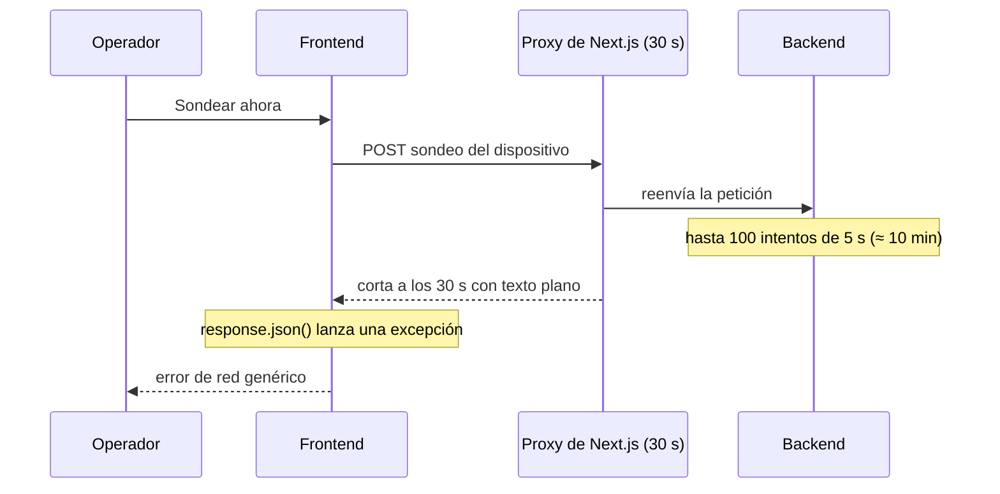

# CF-01 — El sondeo manual superaba el tiempo máximo del proxy

| Campo                                 | Valor                                      |
| ------------------------------------- | ------------------------------------------ |
| Fecha de corrección                   | 2026-09-25                                 |
| Commits                               | backend `2bf606e` · frontend `9178f85`     |
| Contexto                              | Device Monitoring — acción «Sondear ahora» |
| Regla de negocio                      | `MON-021` (nueva)                          |
| Tipo de mantenimiento (ISO/IEC 14764) | Correctivo                                 |
| Fecha de detección · quién · impacto  | `[CONFIRMAR]`                              |

## 1. Identificación

Al pedir un sondeo manual de un dispositivo inalcanzable con un umbral de fallas alto, el frontend recibía el texto plano `Internal Server Error` en lugar de un resultado, y mostraba un error de red genérico.

Cómo se detectó: `[CONFIRMAR]` (el commit describe el síntoma, no el origen del reporte).

## 2. Análisis de causa raíz

El número de intentos de un sondeo salía del parámetro `failuresBeforeDown` del dispositivo, que también es el presupuesto de intentos dentro de un ciclo. Un sondeo manual usaba ese presupuesto completo, y cada intento puede esperar hasta 5 segundos.

| Dato                                             | Valor        |
| ------------------------------------------------ | ------------ |
| Umbral configurado en el caso reportado          | 100 intentos |
| Espera máxima por intento                        | 5 s          |
| Duración posible de la petición                  | ≈ 10 minutos |
| Tiempo máximo del proxy de Next.js en producción | 30 s         |

El proxy cortaba la conexión y respondía en texto plano; el frontend intentaba interpretarla como JSON, la conversión lanzaba una excepción y el usuario veía un error de red genérico.

Hay **dos defectos** distintos: una operación interactiva sin cota de tiempo (backend) y un cliente que no tolera respuestas que no son JSON (frontend).

## 3. Diseño e implementación de la corrección

| Repositorio | Cambio                                                                                                                                                                                                                  |
| ----------- | ----------------------------------------------------------------------------------------------------------------------------------------------------------------------------------------------------------------------- |
| Backend     | `ExecutePollingCycleUseCase`: constante `MANUAL_POLL_MAX_ATTEMPTS = 3`. Si el sondeo es manual (`forceExecution`), los intentos son `min(failuresBeforeDown, 3)`. Los sondeos programados conservan el umbral completo. |
| Frontend    | `src/services/api.service.ts`: si el cuerpo no es JSON, devuelve `El servidor no respondió correctamente (HTTP <estado>). Inténtalo de nuevo.`                                                                          |

**Consecuencia aceptada y documentada.** Un sondeo manual de un dispositivo inalcanzable lo marca caído tras 3 intentos, antes de lo que permitiría la tolerancia configurada en el sondeo programado. La regla `MON-021` lo declara de forma explícita. Un umbral menor que 3 no se eleva.

## 4. Pruebas

Backend — `tests/application/device-monitoring/use-cases/ExecutePollingCycleUseCase.test.ts`, bloque `attempt budget`:

1. `should run the full threshold on a scheduled poll`
2. `should cap a manual poll at 3 attempts`
3. `should not raise a manual poll above a threshold lower than the cap`

Frontend — el commit solo modifica `api.service.ts`; **no añade una prueba automatizada** para la respuesta no-JSON. `[CONFIRMAR]` si se verificó manualmente.

## 5. Documentación actualizada

- `docs/business-rules/device-monitoring.md`: nueva regla `MON-021` (tipo _Policy_, _Since_ 2026-09-25, con la justificación del límite de 30 s).
- `docs/BACKEND_API.md`: nota sobre el máximo de 3 intentos del sondeo manual y su tiempo de respuesta (menos de unos 20 s).

## 6. Trazabilidad

| Regla     | Código                                                                                                   | Prueba                                           |
| --------- | -------------------------------------------------------------------------------------------------------- | ------------------------------------------------ |
| `MON-021` | `src/application/device-monitoring/use-cases/ExecutePollingCycleUseCase.ts` (`MANUAL_POLL_MAX_ATTEMPTS`) | `ExecutePollingCycleUseCase.test.ts` (3 pruebas) |
| —         | `src/services/api.service.ts` (frontend)                                                                 | Sin prueba automatizada `[CONFIRMAR]`            |

## 7. Lecciones y mejoras

- Una operación que espera un operador necesita un presupuesto de tiempo menor que el de la infraestructura que tiene delante.
- El cliente debe tratar cualquier respuesta como potencialmente ajena a su contrato (proxys, balanceadores).
- _Mejora propuesta_: prueba unitaria del manejo de respuestas no-JSON en el servicio de API del frontend.
