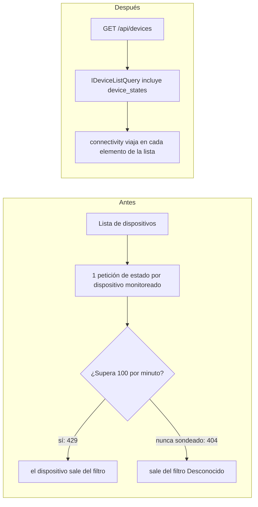

# CF-03 — El filtro de conectividad perdía dispositivos por el límite de peticiones

| Campo                                 | Valor                                                                                     |
| ------------------------------------- | ----------------------------------------------------------------------------------------- |
| Fechas                                | 2026-09-26 (mitigación y cambio de backend) · 2026-09-28 (cambio estructural en frontend) |
| Commits                               | frontend `4fd2879`, `2e7783d` · backend `254f5a6`                                         |
| Contexto                              | Device Inventory — lista de dispositivos, filtro «Desconectado / Desconocido», panel      |
| Reglas de negocio                     | `DEV-148`, `DEV-149` (nuevas)                                                             |
| Tipo de mantenimiento (ISO/IEC 14764) | Correctivo (mitigación) + perfectivo (solución estructural)                               |
| Fecha de detección · quién · impacto  | `[CONFIRMAR]`                                                                             |

## 1. Identificación

El filtro «Desconectado» podía no mostrar nada aunque existieran dispositivos desconectados, y «Desconocido» quedaba vacío para los dispositivos nunca sondeados. Cómo se detectó: `[CONFIRMAR]`.

## 2. Análisis de causa raíz

La lista de dispositivos **no traía la conectividad**; el frontend la completaba pidiendo el estado de sondeo **de cada dispositivo monitoreado**, una petición por fila. No existía un endpoint masivo.

| Situación                                                                   | Qué ocurría                                                                                       |
| --------------------------------------------------------------------------- | ------------------------------------------------------------------------------------------------- |
| Más peticiones que el presupuesto de lectura (100 por minuto para esa ruta) | Las peticiones sobrantes respondían **429**; el dispositivo quedaba sin estado y salía del filtro |
| Dispositivo nunca sondeado                                                  | El endpoint respondía **404**; también salía del filtro, vaciando «Desconocido»                   |
| Cada página, orden, filtro o refresco                                       | Volvía a gastar el presupuesto                                                                    |

## 3. Diseño e implementación: dos etapas

**Etapa 1 — mitigación en el frontend (`4fd2879`, 2026-09-26).** Sin cambiar el contrato con el backend:

- Los estados se guardan en caché 30 s en una consulta compartida con el panel (`src/hooks/pollingStatusQuery.ts`).
- Un 404 cuenta como `UNKNOWN`, tal como define la API.
- Una consulta rechazada **lanza un error** en lugar de devolver una lista vacía, para que un fallo no se presente como «no hay dispositivos».
- El botón de refrescar sigue pidiendo lecturas nuevas.

**Etapa 2 — solución estructural (backend `254f5a6`, 2026-09-26; frontend `2e7783d`, 2026-09-28).**

- El backend incluye en cada elemento de `GET /api/devices` un objeto `connectivity` con `status` (`UP`, `DOWN`, `UNKNOWN`), `downSince` y `lastSeen` (`DEV-148`), y acepta filtrar por conectividad y ordenar por inicio de la caída (`DEV-149`).
- El listado sale de `IDeviceRepository` y pasa a un puerto de **solo lectura**, `IDeviceListQuery`, implementado por `PrismaDeviceListQuery`, que incluye la relación con `device_states` en la misma consulta y devuelve DTOs. `countByFilters` deja el repositorio.
- El frontend elimina la petición por fila y muestra cuánto tiempo lleva caído cada dispositivo.

## 4. Pruebas

| Capa                      | Archivo                                                                               | Qué cubre                                                                         |
| ------------------------- | ------------------------------------------------------------------------------------- | --------------------------------------------------------------------------------- |
| Infraestructura           | `tests/infrastructure/persistence/PrismaDeviceListQuery.test.ts`                      | `[DEV-148]` conectividad por elemento; `[DEV-149]` filtro y orden por `downSince` |
| Aplicación                | `tests/application/device-inventory/use-cases/ListDevicesUseCase.test.ts`             | `[DEV-148]` filtro de conectividad                                                |
| Integración (caso de uso) | `tests/integration/use-cases/device-inventory/ListDevicesUseCase.integration.test.ts` | `[DEV-148][DEV-149]` con base de datos real                                       |
| Integración (HTTP)        | `tests/integration/device.routes.test.ts`                                             | `200` con filtro y `400` ante un valor de conectividad desconocido                |

Frontend: la etapa 1 no añade pruebas. `[CONFIRMAR]`

## 5. Documentación actualizada

`docs/business-rules/device-inventory.md` (64 líneas modificadas: `DEV-148`, `DEV-149`) y `docs/BACKEND_API.md` (41 líneas modificadas con el nuevo campo y los parámetros).

## 6. Trazabilidad

| Regla     | Código                                                                                                                                                                                                                                                             | Pruebas                                                               |
| --------- | ------------------------------------------------------------------------------------------------------------------------------------------------------------------------------------------------------------------------------------------------------------------ | --------------------------------------------------------------------- |
| `DEV-148` | `src/infrastructure/persistence/PrismaDeviceListQuery.ts`, `src/application/device-inventory/use-cases/ListDevicesUseCase.ts`, `src/application/device-inventory/interfaces/IDeviceListQuery.ts`, `src/application/device-inventory/dtos/DeviceConnectivityDTO.ts` | Las cuatro pruebas de la sección 4                                    |
| `DEV-149` | `PrismaDeviceListQuery.ts`, `src/infrastructure/persistence/device-listing.ts`                                                                                                                                                                                     | `PrismaDeviceListQuery.test.ts`, `device.routes.test.ts`, integración |

## 7. Base de datos

La consulta de lista une `devices` con `device_states` (modelo `DeviceState`, tabla `device_states`: `status`, `downSince`, `lastSeen`) y con el agente de sondeo cuando el dispositivo está detrás de uno. El diagrama entidad-relación completo se documentará en el modelo de datos (pendiente, ver el índice).

## 8. Lecciones y mejoras

- Una solución que depende de N peticiones por pantalla escala mal contra un límite de tasa; la causa de fondo era un contrato de API que obligaba al cliente a hacer ese abanico.
- La mitigación (caché) y la solución (contrato nuevo) son cambios distintos y se entregaron por separado: primero se detuvo el daño, después se corrigió el diseño.
- Un error nunca debe presentarse como una lista vacía.
