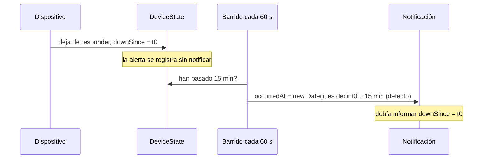

# CF-06 — La alerta de caída diferida informaba la hora equivocada

| Campo                                 | Valor                                       |
| ------------------------------------- | ------------------------------------------- |
| Fecha de corrección                   | 2026-09-25                                  |
| Commit (backend)                      | `3c585d9`                                   |
| Contexto                              | Notifications — alerta de dispositivo caído |
| Regla de negocio                      | `NOT-097` (revisada el 2026-09-25)          |
| Tipo de mantenimiento (ISO/IEC 14764) | Correctivo                                  |
| Fecha de detección · quién · impacto  | `[CONFIRMAR]`                               |

## 1. Identificación

Una notificación de caída que se enviaba **después** del retardo configurado (o que quedaba retenida por horas de silencio) informaba como momento de la caída la hora en que corrió la verificación, no la hora en que el dispositivo dejó de responder. Un mensaje entregado 15 minutos tarde decía que el dispositivo se había caído hacía un instante. Cómo se detectó: `[CONFIRMAR]`.

## 2. Análisis de causa raíz

La regla `NOT-097` establece que la alerta se **registra** al producirse la transición a caído, pero la **notificación** espera a que la caída supere el retardo. Un barrido periódico (`RaiseOverdueDeviceDownAlertsUseCase`, cada 60 s) revisa los dispositivos caídos y llama a `SendDeviceDownAlertUseCase`. Ese barrido le pasaba `new Date()` como `occurredAt`.

_(Tiempos expresados como `t0` a modo de ejemplo; el retardo de 15 minutos es el que usa la regla como ilustración.)_

Hallazgo adicional: la prueba existente **verificaba el comportamiento erróneo**. Su título decía `should pass the device id, consecutiveFailures and a fresh occurredAt`: la prueba exigía precisamente el valor incorrecto.

## 3. Diseño e implementación de la corrección

Una línea de código: el barrido pasa el `downSince` del estado del dispositivo como `occurredAt`. Dos archivos de apoyo: la prueba y la regla.

## 4. Pruebas

`tests/application/notifications/use-cases/RaiseOverdueDeviceDownAlertsUseCase.test.ts`: la prueba pasa a llamarse `should pass the device id, consecutiveFailures and downSince as occurredAt` y espera `occurredAt = FIXED_DATE − ALERT_DELAY_MS` (la caída empezó un retardo antes del instante del barrido).

## 5. Documentación actualizada

`docs/business-rules/notifications.md`, regla `NOT-097`: se añade que la notificación informa `downSince` como el momento en que ocurrió la caída (revisión 2026-09-25), incluso si se envía tras el retardo o tras horas de silencio.

## 6. Trazabilidad

| Regla     | Código                                                                           | Prueba                                                                                  |
| --------- | -------------------------------------------------------------------------------- | --------------------------------------------------------------------------------------- |
| `NOT-097` | `src/application/notifications/use-cases/RaiseOverdueDeviceDownAlertsUseCase.ts` | `tests/application/notifications/use-cases/RaiseOverdueDeviceDownAlertsUseCase.test.ts` |
| `NOT-097` | `src/domain/device-monitoring/aggregates/DeviceState.ts` (`downSince`)           | `tests/domain/device-monitoring/aggregates/DeviceState.test.ts`                         |

## 7. Lecciones y mejoras

- Una prueba escrita a partir de la implementación y no de la regla puede fijar un defecto. La regla `NOT-097` es ahora la referencia explícita del comportamiento esperado.
- Separar «cuándo ocurrió» de «cuándo se notificó» es una distinción de dominio que conviene reflejar en los nombres de los campos del mensaje.
- Un cambio mínimo (una línea) requirió tres artefactos: código, prueba y regla. Es el patrón que sigue el resto de ciclos de este conjunto.
